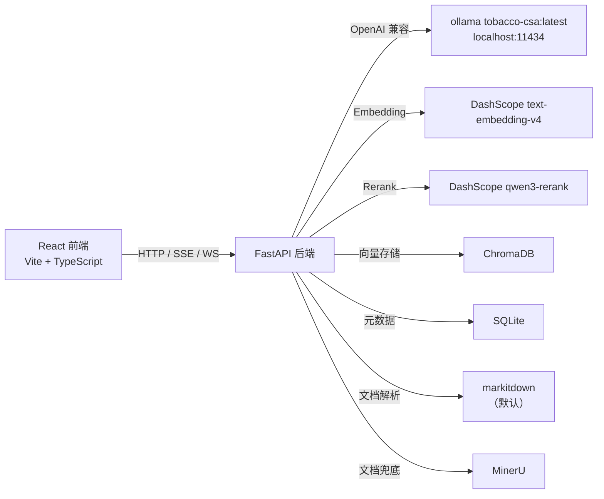
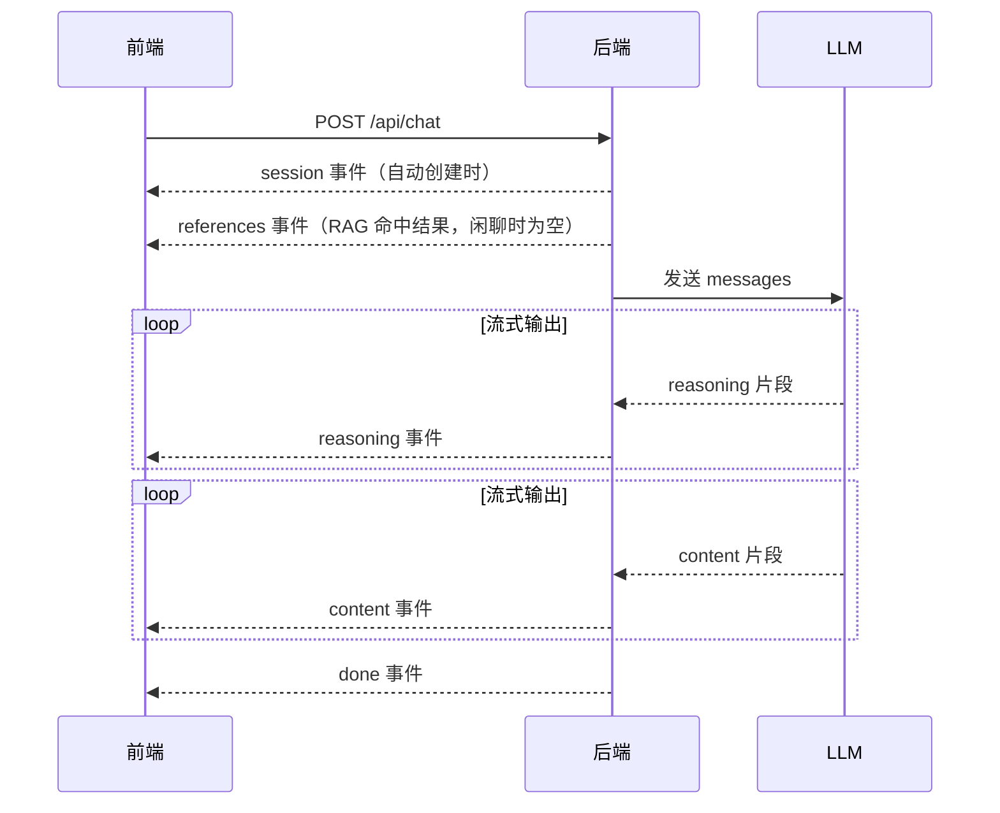
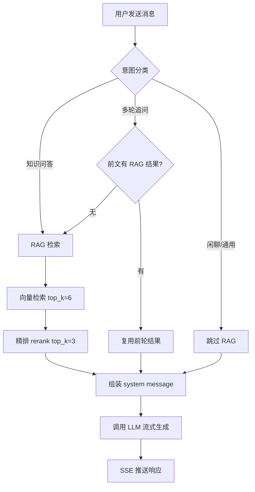
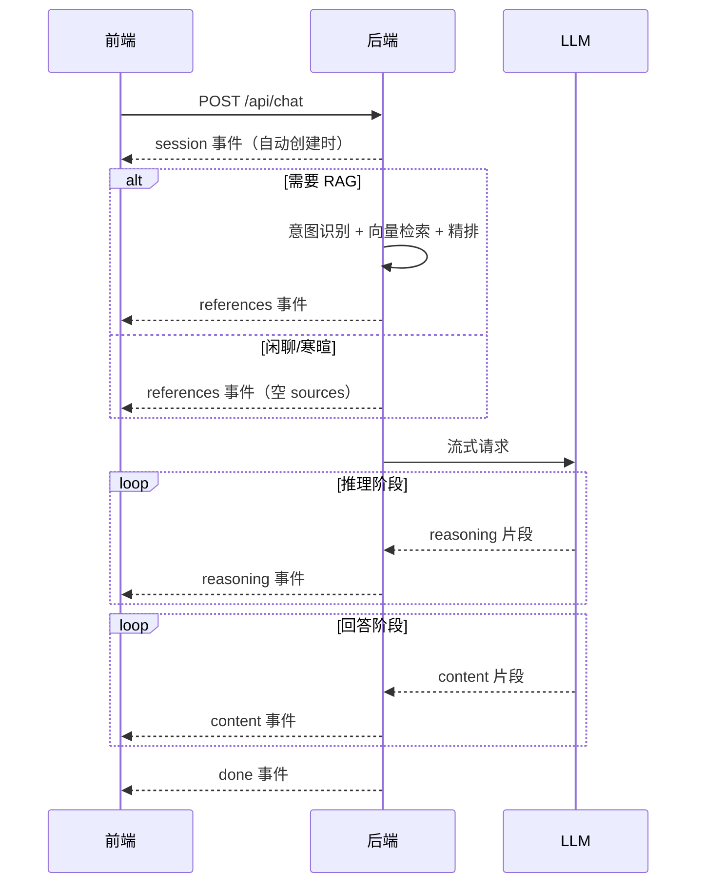
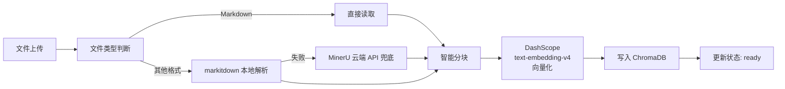
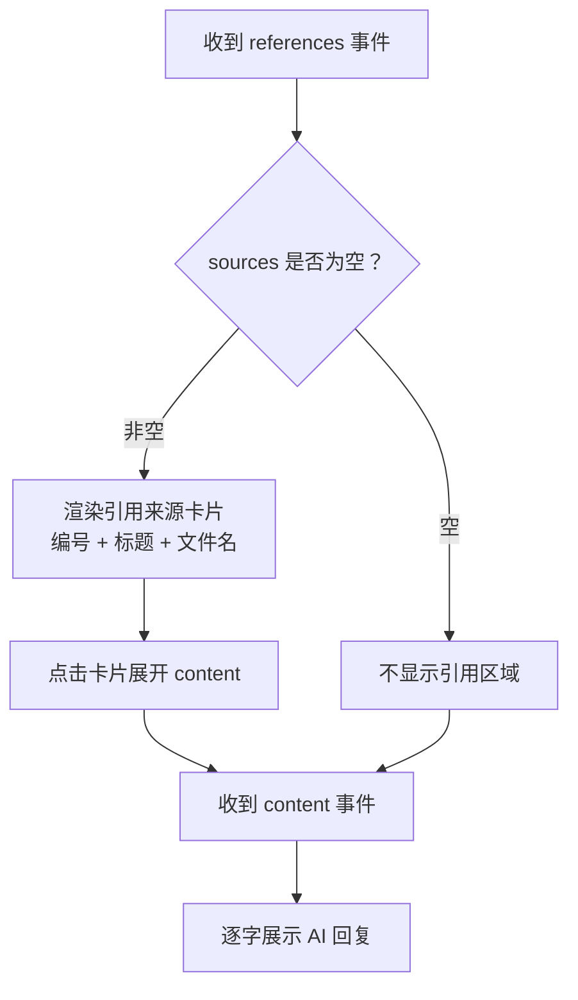

# API 文档

> 前后端开发的唯一约定。所有接口基地址：`http://localhost:8000/api`

---

## 一、系统概览



---

## 二、通用约定

### 2.1 请求头

| 请求头 | 值 | 说明 |
|--------|---|------|
| `Content-Type` | `application/json` | 除文件上传外的所有请求 |
| `Content-Type` | `multipart/form-data` | 文件上传 |

### 2.2 响应格式

**成功响应（非 SSE）：**

```json
{
    "code": 0,
    "data": { ... },
    "msg": "ok"
}
```

**错误响应：**

```json
{
    "code": 400,
    "data": null,
    "msg": "错误描述信息"
}
```

**HTTP 状态码：**

| 状态码 | 含义 |
|--------|------|
| 200 | 成功 |
| 201 | 创建成功 |
| 204 | 删除成功（无响应体） |
| 400 | 请求参数错误 |
| 404 | 资源不存在 |
| 500 | 服务器内部错误 |

### 2.3 SSE 流式响应格式

对话接口使用 Server-Sent Events，响应头：`Content-Type: text/event-stream`

```
data: {"type": "session", "session_id": "uuid-xxx"}\n\n
data: {"type": "references", "sources": [...]}\n\n
data: {"type": "reasoning", "text": "..."}\n\n
data: {"type": "content", "text": "..."}\n\n
data: {"type": "done", "text": ""}\n\n
```

每个 `data:` 行是一个 JSON 对象，`\n\n` 分隔不同事件。`session` 事件仅在自动创建会话时推送。



---

## 三、数据模型定义

### 3.1 Session（会话）

```typescript
interface Session {
    id: string;              // UUID
    title: string;           // 会话标题（首条用户消息截取前20字）
    message_count: number;   // 消息轮次计数
    created_at: string;      // ISO 8601 格式
    updated_at: string;      // ISO 8601 格式
}
```

### 3.2 Message（消息）

```typescript
interface Message {
    id: number;
    session_id: string;
    role: "user" | "assistant";
    content: string;                    // 正文内容
    reasoning_content: string | null;   // 推理过程（仅 assistant，可为 null）
    references: SourceInfo[] | null;    // 引用来源（仅 assistant，可为 null）
    created_at: string;                 // ISO 8601 格式
}
```

### 3.3 SourceInfo（引用来源）

```typescript
interface SourceInfo {
    index: number;       // 编号，从 1 开始
    title: string;       // 文档标题（heading_path 最后一级标题）
    filename: string;    // 源文件名
    content: string;     // 命中的子块内容（截取前 200 字）
}
```

### 3.4 KnowledgeDoc（知识库文档）

```typescript
interface KnowledgeDoc {
    id: number;
    filename: string;                                                  // 文件名
    file_type: "pdf" | "word" | "image" | "markdown" | "html";     // 文件类型
    chunk_count: number;                                               // 分块数量
    status: "processing" | "ready" | "failed";                         // 处理状态
    created_at: string;                                                // ISO 8601 格式
}
```

### 3.5 StatsOverview（统计总览）

```typescript
interface StatsOverview {
    total_sessions: number;    // 总会话数
    total_messages: number;    // 总消息数
    total_docs: number;        // 知识库文档数
    kb_hit_rate: number;       // 知识库命中率（百分比，如 78.5）
}
```

### 3.6 TopQuestion（热门问题）

```typescript
interface TopQuestion {
    question: string;   // 问题文本
    count: number;      // 出现次数
}
```

---

## 四、对话接口

### 4.1 发送消息（SSE 流式）

**`POST /api/chat`**

发送用户消息，返回 SSE 流式响应。系统会自动判断当前问题是否需要检索知识库（意图路由），仅在需要时执行 RAG 检索。

**意图路由机制：**

系统对每条用户消息进行意图分类，决定是否走 RAG 流程：

| 意图类型 | 是否走 RAG | 典型场景 |
|----------|-----------|---------|
| 知识问答 | 是 | 涉及烟草产品参数、法规政策、行业标准等 |
| 闲聊/通用 | 否 | 打招呼、闲谈、与烟草无关的通用问题 |
| 多轮追问 | 视上下文 | 参考前文的补充问题，可能复用前轮 RAG 结果 |



**请求体：**

```json
{
    "session_id": "a1b2c3d4-e5f6-7890-abcd-ef1234567890",
    "message": "黄鹤楼硬蓝的焦油量是多少？"
}
```

| 字段 | 类型 | 必填 | 说明 |
|------|------|------|------|
| session_id | string | 是 | 会话 ID |
| message | string | 是 | 用户消息内容 |

**响应：`Content-Type: text/event-stream`**

**事件时序：**



**事件格式：**

**session 事件（仅自动创建会话时）：**

```json
{"type": "session", "session_id": "a1b2c3d4-e5f6-7890-abcd-ef1234567890"}
```
- 前端可根据此字段决定是否显示"知识库检索中"的加载状态

**references 事件：**

```json
{
    "type": "references",
    "sources": [
        {
            "index": 1,
            "title": "黄鹤楼产品参数",
            "filename": "huanghelou.pdf",
            "content": "黄鹤楼（硬蓝）：焦油量10mg，烟气烟碱量1.0mg，烟气一氧化碳量11mg..."
        },
        {
            "index": 2,
            "title": "烤烟型卷烟标准",
            "filename": "standard.md",
            "content": "烤烟型卷烟是指以烤烟为主要原料..."
        }
    ]
}
```

- `sources` 为检索命中的文档列表，按精排分数降序排列
- 精排参数：`RAG_RETRIEVAL_TOP_K=6`（初检），`RAG_RERANK_TOP_K=3`（精排后保留）
- 如果意图路由判断不需要 RAG（闲聊/寒暄），`sources` 为空数组 `[]`
- 如果 RAG 检索无命中结果，`sources` 也为空数组 `[]`
- 前端收到后**立即渲染**引用来源卡片，无需等待 LLM 回复

**reasoning 事件：**

```json
{"type": "reasoning", "text": "用户询问黄鹤楼硬蓝的焦油量，"}
{"type": "reasoning", "text": "让我在知识库中查找相关信息..."}
```

- `text` 为推理过程的增量文本片段
- 前端可选择展示或隐藏（折叠显示）
- 不是所有模型都有推理内容，可能为空流

**content 事件：**

```json
{"type": "content", "text": "根据"}
{"type": "content", "text": "知识库信息，"}
{"type": "content", "text": "黄鹤楼（硬蓝）的焦油量为 10mg。"}
```

- `text` 为最终回答的增量文本片段
- 前端逐字拼接展示

**done 事件：**

```json
{"type": "done", "text": ""}
```

- 标记本次回复结束
- 前端收到后停止 loading 状态，将完整回复存入本地状态

**错误情况（SSE 内推送）：**

```json
{"type": "error", "text": "模型调用超时，请重试"}
```

---

### 4.2 创建会话

**`POST /api/sessions`**

**请求体：**

```json
{
    "title": "可选的自定义标题"
}
```

| 字段 | 类型 | 必填 | 说明 |
|------|------|------|------|
| title | string | 否 | 不传则默认为"新对话" |

**响应：`201 Created`**

```json
{
    "code": 0,
    "data": {
        "id": "a1b2c3d4-e5f6-7890-abcd-ef1234567890",
        "title": "新对话",
        "message_count": 0,
        "created_at": "2025-06-25T10:00:00Z",
        "updated_at": "2025-06-25T10:00:00Z"
    },
    "msg": "ok"
}
```

---

### 4.3 获取会话列表

**`GET /api/sessions`**

按 `updated_at` 降序排列（最近活跃的在最前面）。

**响应：`200 OK`**

```json
{
    "code": 0,
    "data": [
        {
            "id": "a1b2c3d4-e5f6-7890-abcd-ef1234567890",
            "title": "黄鹤楼硬蓝的焦油量",
            "message_count": 6,
            "created_at": "2025-06-25T10:00:00Z",
            "updated_at": "2025-06-25T10:05:00Z"
        },
        {
            "id": "b2c3d4e5-f6a7-8901-bcde-f12345678901",
            "title": "烟草专卖许可证办理流程",
            "message_count": 4,
            "created_at": "2025-06-25T09:00:00Z",
            "updated_at": "2025-06-25T09:10:00Z"
        }
    ],
    "msg": "ok"
}
```

---

### 4.4 获取会话消息历史

**`GET /api/sessions/{session_id}/messages`**

获取指定会话的所有消息，按 `created_at` 升序排列。

**路径参数：**

| 参数 | 类型 | 说明 |
|------|------|------|
| session_id | string | 会话 ID |

**响应：`200 OK`**

```json
{
    "code": 0,
    "data": [
        {
            "id": 1,
            "session_id": "a1b2c3d4-...",
            "role": "user",
            "content": "黄鹤楼硬蓝的焦油量是多少？",
            "reasoning_content": null,
            "references": null,
            "created_at": "2025-06-25T10:00:00Z"
        },
        {
            "id": 2,
            "session_id": "a1b2c3d4-...",
            "role": "assistant",
            "content": "根据知识库信息，黄鹤楼（硬蓝）的焦油量为 10mg。",
            "reasoning_content": "用户询问黄鹤楼硬蓝的焦油量...",
            "references": [
                {
                    "index": 1,
                    "title": "黄鹤楼产品参数",
                    "filename": "huanghelou.pdf",
                    "content": "焦油量10mg..."
                }
            ],
            "created_at": "2025-06-25T10:00:05Z"
        }
    ],
    "msg": "ok"
}
```

**错误：会话不存在**

```json
{
    "code": 404,
    "data": null,
    "msg": "会话不存在"
}
```

---

### 4.5 删除会话

**`DELETE /api/sessions/{session_id}`**

级联删除该会话的所有消息、压缩记录、问答日志。

**路径参数：**

| 参数 | 类型 | 说明 |
|------|------|------|
| session_id | string | 会话 ID |

**响应：`204 No Content`**（无响应体）

**错误：会话不存在**

```json
{
    "code": 404,
    "data": null,
    "msg": "会话不存在"
}
```

---

## 五、知识库接口

### 5.1 上传文档

**`POST /api/knowledge/upload`**

上传文件到知识库，系统自动解析、分块、向量化。

**请求：`multipart/form-data`**

| 字段 | 类型 | 必填 | 说明 |
|------|------|------|------|
| files | File[] | 是 | 支持多个文件，支持 pdf/doc/docx/html/htm/md/png/jpg/jpeg/webp |

**支持的文件格式：**

| 格式 | 扩展名 | file_type 值 | 默认解析 | 兜底方案 |
|------|--------|-------------|---------|---------|
| PDF | .pdf | pdf | markitdown 本地解析 | MinerU 云端 API |
| Word | .doc, .docx | word | markitdown 本地解析 | MinerU 云端 API |
| Markdown | .md | markdown | 直接使用 | — |
| HTML | .html, .htm | html | markitdown 本地解析 | 纯文本提取 |
| 图片 | .png, .jpg, .jpeg, .webp | image | markitdown 本地解析 | MinerU 云端 API + OCR |

**文档处理流程：**



**响应：`201 Created`**

```json
{
    "code": 0,
    "data": {
        "message": "3 个文件已提交处理",
        "docs": [
            {
                "id": 1,
                "filename": "烟草专卖法.pdf",
                "file_type": "pdf",
                "chunk_count": 0,
                "status": "processing",
                "created_at": "2025-06-25T10:00:00Z"
            },
            {
                "id": 2,
                "filename": "卷烟分类标准.docx",
                "file_type": "docx",
                "chunk_count": 0,
                "status": "processing",
                "created_at": "2025-06-25T10:00:00Z"
            },
            {
                "id": 3,
                "filename": "焦油量数据.md",
                "file_type": "md",
                "chunk_count": 0,
                "status": "processing",
                "created_at": "2025-06-25T10:00:00Z"
            }
        ]
    },
    "msg": "ok"
}
```

**说明：**
- 上传后异步处理，`status` 初始为 `processing`
- 处理完成后 `status` 变为 `ready`，`chunk_count` 更新为实际分块数
- 处理失败则 `status` 变为 `failed`
- 前端可通过轮询 `GET /api/knowledge/documents` 或 WebSocket `/api/ws/status` 查看处理进度

---

### 5.2 获取文档列表

**`GET /api/knowledge/documents`**

获取知识库中所有文档及其处理状态。按 `created_at` 降序排列。

**响应：`200 OK`**

```json
{
    "code": 0,
    "data": [
        {
            "id": 1,
            "filename": "烟草专卖法.pdf",
            "file_type": "pdf",
            "chunk_count": 45,
            "status": "ready",
            "created_at": "2025-06-25T10:00:00Z"
        },
        {
            "id": 2,
            "filename": "卷烟分类标准.docx",
            "file_type": "docx",
            "chunk_count": 23,
            "status": "ready",
            "created_at": "2025-06-25T09:50:00Z"
        },
        {
            "id": 3,
            "filename": "大文件.pdf",
            "file_type": "pdf",
            "chunk_count": 0,
            "status": "processing",
            "created_at": "2025-06-25T09:40:00Z"
        },
        {
            "id": 4,
            "filename": "损坏文件.pdf",
            "file_type": "pdf",
            "chunk_count": 0,
            "status": "failed",
            "created_at": "2025-06-25T09:30:00Z"
        },
        {
            "id": 5,
            "filename": "产品说明.html",
            "file_type": "html",
            "chunk_count": 12,
            "status": "ready",
            "created_at": "2025-06-25T09:20:00Z"
        }
    ],
    "msg": "ok"
}
```

**前端轮询建议：**
- 上传后每 2 秒轮询一次，直到所有文档 `status` 不再是 `processing`
- 推荐使用 WebSocket `/api/ws/status` 替代轮询，实时获取状态变更
- `ready` 显示绿色状态，`processing` 显示黄色加载动画，`failed` 显示红色

---

### 5.3 删除文档

**`DELETE /api/knowledge/documents/{doc_id}`**

删除指定文档及其在 ChromaDB 中的所有向量分块。

**路径参数：**

| 参数 | 类型 | 说明 |
|------|------|------|
| doc_id | number | 文档 ID |

**响应：`204 No Content`**（无响应体）

**错误：文档不存在**

```json
{
    "code": 404,
    "data": null,
    "msg": "文档不存在"
}
```

---

### 5.4 重试失败文档

**`POST /api/knowledge/retry-failed`**

将所有 `status=failed` 的文档重新加入处理队列。适用于批量重试因临时错误（如 MinerU 超时、网络抖动）而失败的文档。

**请求体：** 无

**响应：`200 OK`**

```json
{
    "code": 0,
    "data": {
        "message": "已重新提交 2 个失败文档",
        "retried_ids": [4, 7]
    },
    "msg": "ok"
}
```

**说明：**
- 将匹配文档的 `status` 重置为 `processing`，重新执行解析、分块、向量化流程
- 如果没有失败文档，返回 `"已重新提交 0 个失败文档"`

---

### 5.5 重新排队卡住文档

**`POST /api/knowledge/requeue-stuck`**

将长时间停留在 `status=processing` 的文档重新排队。适用于处理进程异常退出或崩溃后遗留的"僵尸"文档。

**请求体：**

```json
{
    "stale_minutes": 30
}
```

| 字段 | 类型 | 必填 | 默认值 | 说明 |
|------|------|------|--------|------|
| stale_minutes | number | 否 | 30 | 超过多少分钟视为"卡住" |

**响应：`200 OK`**

```json
{
    "code": 0,
    "data": {
        "message": "已重新排队 1 个卡住文档（阈值：30 分钟）",
        "requeued_ids": [3]
    },
    "msg": "ok"
}
```

**说明：**
- 查找 `status=processing` 且 `created_at` 距当前时间超过 `stale_minutes` 的文档
- 重置为 `processing` 并重新加入处理队列
- 建议配合定时任务或前端按钮调用

---

## 六、WebSocket 实时状态

### 6.1 文档处理状态

**`WS /api/ws/status`**

实时推送文档处理状态变更，替代轮询。客户端连接后自动接收所有文档状态变更事件。

**连接地址：**

```
ws://localhost:8000/api/ws/status
```

**服务端推送消息格式：**

```json
{
    "event": "doc_status",
    "data": {
        "doc_id": 1,
        "filename": "烟草专卖法.pdf",
        "old_status": "processing",
        "new_status": "ready",
        "chunk_count": 45
    }
}
```

**事件类型：**

| event | 说明 | 触发时机 |
|-------|------|---------|
| `doc_status` | 文档状态变更 | 文档从 processing 变为 ready/failed，或从 failed 变为 processing（重试） |
| `doc_progress` | 处理进度 | 解析/向量化过程中间进度（可选，仅部分文档类型支持） |

**doc_progress 事件示例：**

```json
{
    "event": "doc_progress",
    "data": {
        "doc_id": 3,
        "filename": "大文件.pdf",
        "stage": "embedding",
        "progress": 0.65,
        "message": "正在向量化 (32/49 块)"
    }
}
```

| stage 值 | 含义 |
|----------|------|
| `parsing` | 文档解析中（MinerU） |
| `chunking` | 智能分块中 |
| `embedding` | 向量化中 |
| `indexing` | 写入 ChromaDB 中 |

**前端使用示例：**

```javascript
const ws = new WebSocket('ws://localhost:8000/api/ws/status');

ws.onmessage = (event) => {
    const msg = JSON.parse(event.data);

    switch (msg.event) {
        case 'doc_status':
            updateDocStatus(msg.data.doc_id, msg.data.new_status, msg.data.chunk_count);
            break;
        case 'doc_progress':
            updateDocProgress(msg.data.doc_id, msg.data.progress, msg.data.message);
            break;
    }
};

ws.onclose = () => {
    // 自动重连逻辑
    setTimeout(() => connectWebSocket(), 3000);
};
```

---

## 七、统计接口

### 7.1 统计总览

**`GET /api/stats/overview`**

**响应：`200 OK`**

```json
{
    "code": 0,
    "data": {
        "total_sessions": 42,
        "total_messages": 356,
        "total_docs": 15,
        "kb_hit_rate": 78.5
    },
    "msg": "ok"
}
```

| 字段 | 说明 |
|------|------|
| total_sessions | 总会话数 |
| total_messages | 总消息数（user + assistant 各算一条） |
| total_docs | 知识库文档数（status=ready 的） |
| kb_hit_rate | 知识库命中率，百分比（qa_logs 中 kb_hit=1 的比例 * 100） |

---

### 7.2 热门问题

**`GET /api/stats/top-questions`**

获取最常被问到的问题 Top N。

**查询参数：**

| 参数 | 类型 | 必填 | 默认值 | 说明 |
|------|------|------|--------|------|
| limit | number | 否 | 10 | 返回数量上限 |
| days | number | 否 | 7 | 统计最近多少天的数据 |

**示例：`GET /api/stats/top-questions?limit=10&days=7`**

**响应：`200 OK`**

```json
{
    "code": 0,
    "data": [
        {
            "question": "黄鹤楼硬蓝的焦油量是多少",
            "count": 12
        },
        {
            "question": "烟草专卖许可证怎么办理",
            "count": 8
        },
        {
            "question": "卷烟分为哪几类",
            "count": 5
        }
    ],
    "msg": "ok"
}
```

**聚类逻辑说明：**
- 取最近 `days` 天的 qa_logs 中的 user_question
- 对相似问题做归并（精确匹配或简单去重）
- 按出现次数降序排列，返回前 `limit` 条

---

## 八、前端对接指南

### 8.1 SSE 接收示例（JavaScript）

```javascript
const response = await fetch('/api/chat', {
    method: 'POST',
    headers: { 'Content-Type': 'application/json' },
    body: JSON.stringify({ session_id: sessionId, message: userInput })
});

const reader = response.body.getReader();
const decoder = new TextDecoder();
let buffer = '';

while (true) {
    const { done, value } = await reader.read();
    if (done) break;

    buffer += decoder.decode(value, { stream: true });
    const lines = buffer.split('\n');
    buffer = lines.pop(); // 保留未完成的行

    for (const line of lines) {
        if (!line.startsWith('data: ')) continue;
        const data = JSON.parse(line.slice(6));

        switch (data.type) {
            case 'session':
                updateSessionId(data.session_id);    // 自动创建时获取新 session_id
                break;
            case 'references':
                renderReferences(data.sources);       // 立即渲染引用卡片
                break;
            case 'reasoning':
                appendReasoning(data.text);           // 追加推理内容
                break;
            case 'content':
                appendContent(data.text);             // 追加回答内容
                break;
            case 'done':
                finishResponse();                     // 结束 loading
                break;
            case 'error':
                showError(data.text);                 // 显示错误
                break;
        }
    }
}
```

### 8.2 前端状态管理

```typescript
// 会话列表
const sessions: Session[] = [];

// 当前会话消息
const messages: Message[] = [];

// 当前正在生成的回复（SSE 接收中）
const streamingResponse = {
    ragUsed: false,           // 本回合是否走 RAG
    reasoning: '',            // 推理过程（累积）
    content: '',              // 回答内容（累积）
    sources: [],              // 引用来源
    isStreaming: false        // 是否正在接收
};
```

### 8.3 引用来源渲染逻辑



### 8.4 错误处理

| 场景 | 前端处理 |
|------|---------|
| SSE 连接失败 | 提示"网络连接失败，请重试"，保留用户输入 |
| SSE 内 error 事件 | 显示错误信息，保留用户输入 |
| 接口返回 400 | 显示 msg 字段的错误描述 |
| 接口返回 500 | 显示"服务器错误，请稍后重试" |
| 上传文件格式不支持 | 前端校验拦截，提示支持的格式列表 |
| 上传文件过大 | 前端校验拦截（建议单文件 <= 50MB） |
| WebSocket 断连 | 3 秒后自动重连，回退到轮询模式 |

---

## 九、技术栈参考

| 组件 | 选型 | 说明 |
|------|------|------|
| LLM | ollama tobacco-csa:latest | `http://localhost:11434/v1`，OpenAI 兼容接口 |
| Embedding | DashScope text-embedding-v4 | `https://dashscope.aliyuncs.com/compatible-mode/v1`，维度 1024 |
| Reranker | DashScope qwen3-rerank | `https://dashscope.aliyuncs.com/compatible-api/v1` |
| 向量库 | ChromaDB | 本地持久化 |
| 文档解析 | markitdown（默认）+ MinerU（兜底） | HTML/PDF/DOCX/图片转 Markdown |
| 数据库 | SQLite | aiosqlite 异步 |
| RAG 初检 | RAG_RETRIEVAL_TOP_K=6 | 向量检索返回候选数 |
| RAG 精排 | RAG_RERANK_TOP_K=3 | 精排后保留数 |
| 精排阈值 | RAG_RERANK_THRESHOLD=0.3 | 低于此分数的结果被过滤 |
