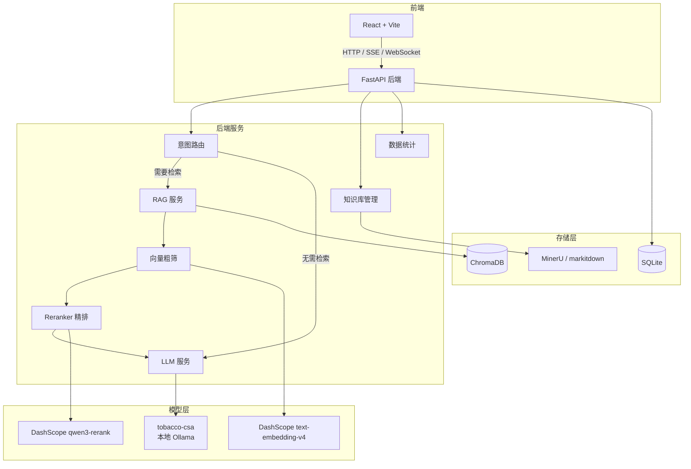
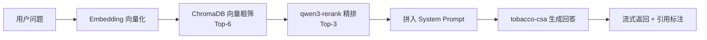
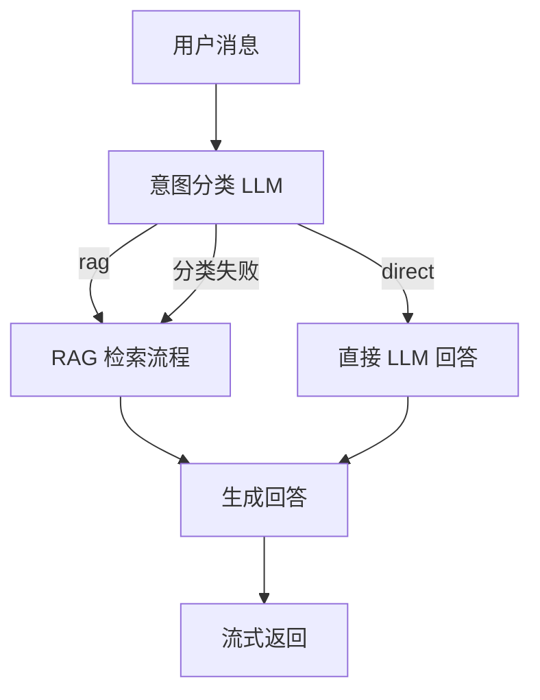
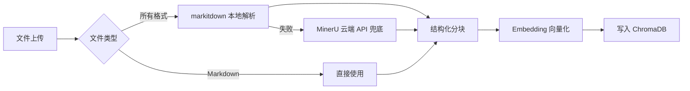
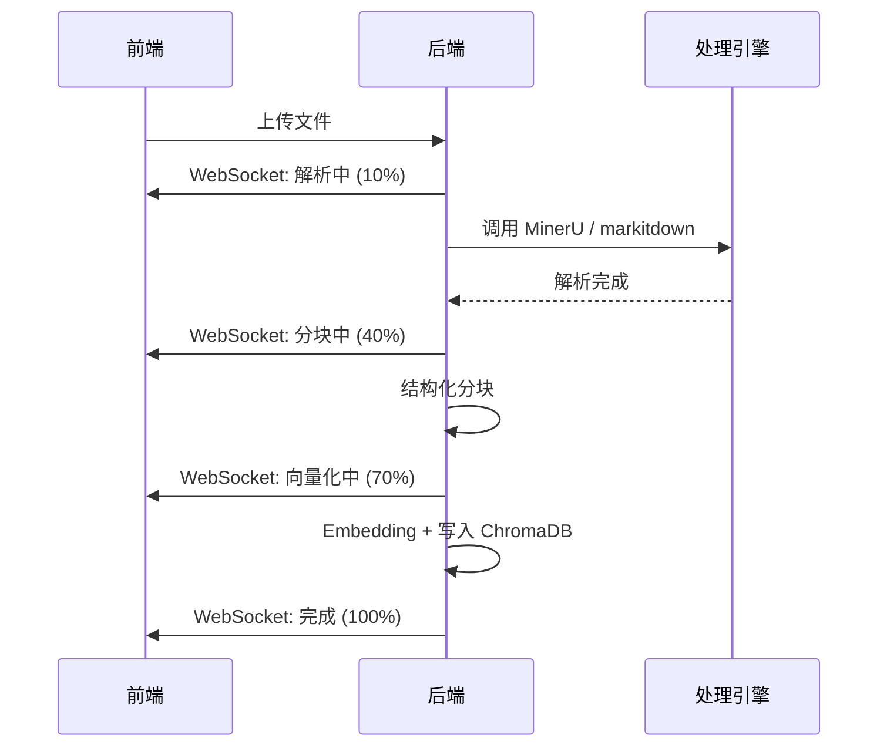

# 烟草智能客服系统 — 产品需求文档（PRD）

## 一、项目概述

| 项目 | 内容 |
|------|------|
| 项目名称 | 烟草智能客服系统 |
| 技术路线 | LLM（tobacco-csa，本地 Ollama）+ RAG（DashScope Embedding + Reranker） |
| 提交截止日期 | 2025-07-03 |
| 是否需要演示 | 是 |

### 项目目标

开发一个烟草行业智能客服系统，基于大语言模型和 RAG 技术，能够根据用户输入的自然语言问题自动生成答案。系统结合预定义知识库生成智能回答，通过大语言模型的自然语言理解能力提升回答的准确性和自然性。

### 系统架构概览



## 二、团队分工

| 角色 | 职责 |
|------|------|
| 用户（我） | 把控整体方向、关键决策、数据准备、模型微调 |
| Claude Code | 后端开发（FastAPI + RAG + 对话管理） |
| 其他 Agent | 前端开发（React） |

**说明：**
- LLM 使用本地 Ollama 部署的 tobacco-csa 模型（已微调）
- Embedding 和 Reranker 使用 DashScope 云端 API
- 数据收集（爬取 Wiki、法律条文等）由用户线下完成，准备好文件后通过系统上传

## 三、功能需求

### 3.1 核心功能

#### F1. RAG 智能问答

| 项目 | 说明 |
|------|------|
| 功能描述 | 用户输入自然语言问题，系统基于知识库检索 + LLM 生成回答 |
| 检索流程 | 向量粗筛 Top-6 → Reranker 精排 Top-3 → 拼入 Prompt |
| 引用展示 | 回复时展示引用了哪些知识库文档，支持点击查看原文片段 |
| 无命中处理 | 知识库无相关内容时，基于 LLM 通用知识回答并标注"仅供参考" |

**RAG 检索流程：**



#### F2. 多轮对话

| 项目 | 说明 |
|------|------|
| 上下文窗口 | 保留最近 15 轮完整对话 |
| 上下文压缩 | 每 15 轮触发一次异步压缩，将 15 轮对话压缩为 ≤50 字/话题的摘要 |
| 压缩策略 | 摘要累积存储，prompt 中拼接所有历史摘要 + 最近 15 轮完整对话 |
| 降级策略 | 压缩未完成时，fallback 使用最近 15 轮完整对话兜底 |

#### F3. 意图路由

| 项目 | 说明 |
|------|------|
| 功能描述 | 系统每轮对话自动判断用户意图，决定是否需要走 RAG 检索流程 |
| 路由策略 | LLM 对用户消息进行意图分类：知识库相关 → 走 RAG；闲聊/通用问题 → 直接回答 |
| 分类方式 | 使用轻量 prompt 让主 LLM（tobacco-csa）返回意图标签（`use_rag: true/false`），单次调用，不额外引入分类模型 |
| 回退机制 | 意图分类失败时默认走 RAG 流程，保证不丢失检索能力 |

**意图路由流程：**



#### F4. 知识库管理

| 项目 | 说明 |
|------|------|
| 文件上传 | 支持 PDF / Word / 图片 / Markdown / HTML 格式上传 |
| 自动处理 | 上传后自动解析（MinerU / markitdown）→ 结构化分块 → 向量化 → 入库 |
| 解析策略 | 默认走 markitdown 本地解析（支持 HTML/PDF/DOCX/图片）；失败时 fallback 到 MinerU 云端 API |
| 实时状态 | 通过 WebSocket 推送文档处理进度，前端实时展示当前阶段（解析中 / 分块中 / 向量化中 / 完成 / 失败） |
| 文档列表 | 展示所有文档的名称、类型、分块数、处理状态 |
| 文档删除 | 支持删除文档，同步清理向量库中的对应分块 |

**文档处理流程：**



**WebSocket 状态推送：**



#### F5. 对话历史

| 项目 | 说明 |
|------|------|
| 存储维度 | 按会话（session）维度存储，每个会话有唯一 ID |
| 用户认证 | 匿名使用，无需登录 |
| 持久化 | SQLite 永久存储 |
| 历史查看 | 左侧栏展示会话列表，点击切换查看历史消息 |

#### F6. 数据统计

| 项目 | 说明 |
|------|------|
| 热门问题 | 最常问的 Top N 问题（按出现次数降序） |
| 命中率 | 知识库命中率（RAG 检索命中的问答占比） |
| 数据来源 | 每次问答记录到 qa_logs 表，统计页面通过 SQL 聚合查询 |

### 3.2 不包含的功能

- 人工转接 / 人工兜底
- 用户登录 / 注册
- 并发支持（单用户使用）
- 数据爬虫（爬取由用户线下完成）

## 四、页面需求

### 4.1 页面列表

| 页面 | 路由 | 说明 |
|------|------|------|
| 对话页面 | `/` | 主页面，ChatGPT 风格 |
| 知识库管理 | `/knowledge` | 文档上传、列表、删除 |
| 数据统计 | `/stats` | 热门问题、命中率 |

### 4.2 对话页面

```mermaid
block-beta
    columns 2
    A["会话列表"]:1 B["对话区域"]:1

    block:A
        columns 1
        A1["+ 新对话"]
        A2["会话 1"]
        A3["会话 2"]
        A4["会话 3"]
    end

    block:B
        columns 1
        B1["用户消息"]
        B2["引用来源: [1] 文档A  [2] 文档B"]
        B3["AI 回复内容..."]
        B4["输入框 + 发送按钮"]
    end
```

**交互细节：**
- 引用来源在 RAG 检索完成后立即展示（不等 LLM 回复）
- AI 回复逐字展示（SSE 流式）
- 推理过程（reasoning）可折叠展示

### 4.3 知识库管理页面

- 文档列表表格：名称、类型、分块数、状态（processing/ready/failed）
- 拖拽上传区域，支持多文件上传（PDF / Word / 图片 / Markdown / HTML）
- 状态颜色：processing 黄色、ready 绿色、failed 红色
- 文档处理进度实时展示（通过 WebSocket 接收，显示当前阶段和百分比）
- 删除操作需二次确认

### 4.4 数据统计页面

- 热门问题 Top 10（表格展示）
- 知识库命中率（百分比数字 + 趋势折线图）

### 4.5 UI 风格

参考 ChatGPT 网页端，简洁专业风格。

## 五、技术约束

| 约束项 | 说明 |
|------|------|
| 语言 | Python 3.11+（uv 管理） |
| LLM | tobacco-csa（本地 Ollama，OpenAI 兼容 API） |
| Embedding | DashScope text-embedding-v4 |
| Reranker | DashScope qwen3-rerank |
| 前端 | React + Vite |
| 数据库 | SQLite |
| 向量库 | ChromaDB（本地持久化） |
| 文档解析 | markitdown（默认，支持 HTML/PDF/DOCX/图片）、MinerU（兜底） |
| 部署 | Docker Compose |
| 并发 | 单用户，不考虑并发 |

## 六、非功能需求

| 需求 | 说明 |
|------|------|
| 响应速度 | 不做限制，由模型层处理 |
| 数据持久化 | 对话历史、知识库文档永久保留 |
| 可扩展性 | 知识库可随时上传新文档扩展 |

## 七、交付物

- [ ] 完整可运行代码（前端 + 后端）
- [ ] 项目文档（Docs/ 目录下所有文档）
- [ ] Docker Compose 部署配置
