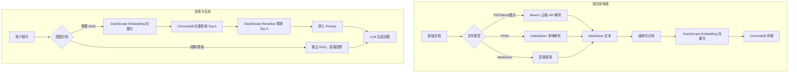
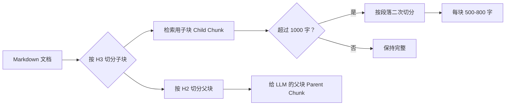
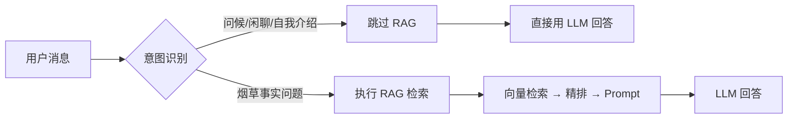
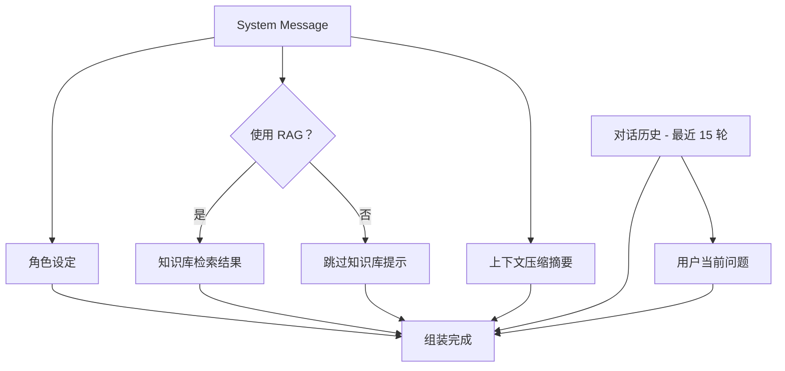
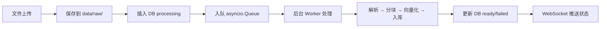

# RAG 设计文档

## 一、整体流程



## 二、文档解析

### 解析策略

默认使用 markitdown（微软开源）本地解析所有格式，失败时 fallback 到 MinerU 云端 API。

| 格式 | 扩展名 | 默认解析 | 兜底方案 |
|------|--------|---------|---------|
| PDF | `.pdf` | markitdown 本地解析 | MinerU 云端 API |
| Word | `.doc` `.docx` | markitdown 本地解析 | MinerU 云端 API |
| 图片 | `.png` `.jpg` `.jpeg` `.webp` | markitdown 本地解析 | MinerU 云端 API + OCR |
| HTML | `.html` `.htm` | markitdown 本地解析 | 纯文本提取 |
| Markdown | `.md` | 直接使用 | — |

### MinerU 输出结构

```markdown
# 文档标题                    ← H1（文章主题）

开头摘要段落...

## 第一大节                   ← H2（完整章节）
### 子节 1                    ← H3（语义段落）
具体内容...
### 子节 2                    ← H3
具体内容...
#### 更细的子节                ← H4
具体内容...

## 第二大节                   ← H2
...
```

**特征：**
- 标题层级清晰（H1 → H2 → H3 → H4）
- 段落边界明确，句子不会被截断
- 表格保留完整结构（`<table>` 标签）
- 图片保留链接，参考文献保留标注

### markitdown（默认解析器）

使用微软开源的 `markitdown` 库作为默认解析器，支持 HTML、PDF、DOCX、图片等多种格式，本地执行。

**优势：**
- 本地执行，无网络依赖和限流风险
- 处理速度快（毫秒级）
- 支持格式广泛（HTML/PDF/DOCX/图片/CSV/Excel/PPT 等）

**兜底机制：**
- HTML 文件：fallback 到纯文本提取
- PDF/Word/图片：fallback 到 MinerU 云端 API

### MinerU 限流与重试

MinerU 云端 API 有请求频率限制（错误码 `-60024`），系统实现指数退避重试：

```python
# 重试策略：15s × 2^attempt，最多 3 次
wait = 15 * (2 ** attempt)  # 15s, 30s, 60s
```

文档处理队列中，非 HTML 文件间隔 8 秒，HTML 文件无需等待。

## 三、分块策略（结构化分块 + 父子分块）

### 设计思路

利用 MinerU / markitdown 输出的 Markdown 标题结构进行语义分块，而非按字符硬切。

### 分块规则



- **检索用子块（Child Chunk）**：按 `###`（H3）级别切分，用于向量检索，粒度细，匹配精准
- **给 LLM 的父块（Parent Chunk）**：按 `##`（H2）级别切分，命中子块后返回其所属父块，上下文完整

### 父子关系示例

```
## 烟草加工                    ← 父块（给 LLM 的完整上下文）
├── ### 风干                   ← 子块 1（用于检索）
├── ### 烤干                   ← 子块 2（用于检索）
├── ### 热风管干燥             ← 子块 3（用于检索）
└── ### 日晒干燥法             ← 子块 4（用于检索）
```

检索时匹配到"风干"子块 → 返回整个"烟草加工"父块给 LLM，LLM 拿到完整的四种加工方法上下文。

### 二次切分

如果单个 H3 块超过 1000 字，按段落（`\n\n`）二次切分，每块保持在 500-800 字。

### 分块数据结构

```python
@dataclass
class Chunk:
    chunk_id: str           # 格式: "doc_{doc_id}_chunk_{index}"
    content: str            # 块的文本内容
    parent_content: str     # 所属父块的完整内容
    metadata: dict          # {source, doc_id, heading_path, chunk_index}
```

## 四、向量化（Embedding）

### 模型

- **模型**：DashScope `text-embedding-v4`
- **维度**：1024
- **调用方式**：DashScope OpenAI 兼容 API（云端）
- **批处理大小**：每次最多 10 条

### 编码方式

```python
# DashScope API 调用
payload = {
    "model": "text-embedding-v4",
    "input": texts,           # 批量输入
    "encoding_format": "float",
    "dimensions": 1024,
}

response = client.post(
    "https://dashscope.aliyuncs.com/compatible-mode/v1/embeddings",
    headers={"Authorization": f"Bearer {DASHSCOPE_API_KEY}"},
    json=payload,
)
```

**特点：**
- 云端 API，无需本地加载模型，启动速度快
- 1024 维向量，中文效果优秀
- 批量处理，每批最多 10 条

## 五、向量存储（ChromaDB）

### Collection 结构

```
Collection: "knowledge_base"
├── ids:        ["doc_1_chunk_0", "doc_1_chunk_1", ...]
├── documents:  ["子块文本内容", ...]
├── embeddings: [[0.12, -0.34, ...], ...]              # 1024 维
└── metadatas:  [
      {
        "source": "烟草百科.pdf",
        "doc_id": 1,
        "heading_path": "烟草百科.pdf > ## 烟草加工 > ### 风干",
        "chunk_index": 0,
        "parent_content": "## 烟草加工\n\n完整父块内容..."
      },
      ...
    ]
```

**关键：`parent_content` 存在 metadata 中**，检索命中子块时直接从 metadata 取出父块，无需二次查询。

### 持久化

ChromaDB 数据持久化到 `data/chroma/` 目录，重启后自动加载。

## 六、检索与精排

### 第一轮：向量粗筛

```python
# 用户问题向量化
query_vec = embedding_service.encode_query(query)

# ChromaDB 检索 Top-6
results = collection.query(
    query_embeddings=[query_vec],
    n_results=6,  # RAG_RETRIEVAL_TOP_K
    include=["documents", "metadatas", "distances"],
)
```

### 第二轮：Reranker 精排

```python
# DashScope Reranker API 调用
payload = {
    "model": "qwen3-rerank",
    "query": query,
    "documents": documents,
    "top_n": 3,  # RAG_RERANK_TOP_K
    "instruct": "Given a web search query, retrieve relevant passages that answer the query.",
}

response = client.post(
    "https://dashscope.aliyuncs.com/compatible-api/v1/reranks",
    headers={"Authorization": f"Bearer {DASHSCOPE_API_KEY}"},
    json=payload,
)
```

### 意图路由

在 RAG 检索之前，系统先判断用户当前轮次是否需要查询知识库：



**需要 RAG 的情况：** 询问烟草产品参数、价格、焦油量、真假鉴别、许可证、经营规范、种植加工等事实问题；追问（短句结合上一轮仍在问烟草事实）。

**不需要 RAG 的情况：** 问候、寒暄、感谢、告别；询问"你是谁"等自我介绍；普通闲聊。

### 最终输出

```python
[
    RetrievalResult(
        content="子块文本（用于展示匹配到的内容）",
        parent_content="父块完整文本（拼入 prompt 给 LLM）",
        rerank_score=0.89,
        metadata={...},
    ),
    ...
]
```

## 七、Prompt 组装

### 整体结构



### System Message 内容

```
[角色设定]
你是烟草行业智能客服助手。请基于提供的知识库内容回答用户问题。

规则：
1. 优先使用知识库中的信息回答
2. 如果知识库中没有相关信息，请如实告知并尽量给出一般性建议
3. 回答要简洁、专业、准确
4. 不要编造不存在的数据或信息

[知识库检索结果]

文档1（精排分数：0.89）：
{parent_content_1}

文档2（精排分数：0.85）：
{parent_content_2}

文档3（精排分数：0.82）：
{parent_content_3}

（如果无检索结果则显示：未检索到相关知识库内容）

[上下文摘要]（如有，多组摘要按时间顺序排列）
第1-15轮摘要：
1. 用户询问了焦油量标准
2. 用户了解了许可证办理流程
...
```

### 跳过 RAG 时的 System Message

当意图路由判断不需要 RAG 时，知识库区块替换为：

```
[知识库状态]
当前问题无需查询知识库，请直接自然回答，不要声称检索了资料。
```

### RAG 检索无结果时

当 Reranker 最高分数低于阈值（`RAG_RERANK_THRESHOLD`）时，知识库区块替换为：

```
[知识库检索结果]
未检索到相关知识库内容。请根据你的通用知识回答，
并在回答开头说明"以下为通用参考信息，具体请以官方资料为准"。
```

### 组装代码逻辑

```python
async def _build_messages(session_id, user_message, rag_results, *, use_rag):
    # 1. System message
    parts = [ROLE_PROMPT]
    if use_rag:
        parts.append(f"[知识库检索结果]\n{_format_rag_results(rag_results)}")
    else:
        parts.append("[知识库状态]\n当前问题无需查询知识库...")

    # 压缩摘要
    comps = await compression.get_compressions(session_id)
    if comps:
        parts.append(f"[上下文摘要]\n{_format_compressions(comps)}")

    system_message = {"role": "system", "content": "\n\n".join(parts)}

    # 2. 对话历史（最近 15 轮 = 30 条消息）
    history = await get_recent_messages(session_id, limit=30)

    # 3. 组装
    return [system_message] + history + [{"role": "user", "content": user_message}]
```

## 八、技术选型汇总

| 组件 | 模型/工具 | 用途 | 运行方式 |
|------|----------|------|---------|
| 文档解析 | markitdown（微软） | HTML/PDF/DOCX/图片 → Markdown（默认） | 本地 |
| 文档解析 | MinerU Standard API | PDF/Word/图片 → Markdown（兜底） | 云端 API（需 Token） |
| 分块 | 自定义结构化分块 | 按 Markdown 标题层级切分 | 本地 |
| Embedding | DashScope `text-embedding-v4` | 文本向量化（1024 维） | 云端 API |
| 向量数据库 | ChromaDB | 向量存储与检索 | 本地 |
| Reranker | DashScope `qwen3-rerank` | 粗排结果精排 | 云端 API |
| 意图路由 | LLM（tobacco-csa） | 判断是否需要 RAG | 本地（Ollama） |
| LLM | tobacco-csa（Ollama） | 最终回答生成 | 本地 |
| 文档队列 | asyncio.Queue | 后台异步文档处理 | 本地 |

## 九、配置项

```python
# DashScope Embedding
DASHSCOPE_API_KEY = "sk-..."
DASHSCOPE_EMBEDDING_BASE_URL = "https://dashscope.aliyuncs.com/compatible-mode/v1"
DASHSCOPE_EMBEDDING_MODEL = "text-embedding-v4"
DASHSCOPE_EMBEDDING_DIMENSIONS = 1024
DASHSCOPE_EMBEDDING_BATCH_SIZE = 10  # 每批最多 10 条

# DashScope Reranker
DASHSCOPE_RERANK_BASE_URL = "https://dashscope.aliyuncs.com/compatible-api/v1"
DASHSCOPE_RERANK_MODEL = "qwen3-rerank"
DASHSCOPE_RERANK_INSTRUCT = "Given a web search query, retrieve relevant passages that answer the query."

# ChromaDB
CHROMA_PERSIST_DIR = "./data/chroma"
CHROMA_COLLECTION = "knowledge_base"

# RAG
RAG_RETRIEVAL_TOP_K = 6         # 向量粗筛数量
RAG_RERANK_TOP_K = 3            # Reranker 精排后保留数量
RAG_RERANK_THRESHOLD = 0.0      # 低于此值视为未命中

# 分块
CHUNK_MAX_SIZE = 1000           # 单块最大字数，超过则二次切分
CHUNK_TARGET_SIZE = 500         # 二次切分目标字数

# MinerU
MINERU_TOKEN = "..."

# LLM（本地 Ollama）
LLM_BASE_URL = "http://localhost:11434/v1"
LLM_API_KEY = "ollama"
LLM_MODEL = "tobacco-csa:latest"
```

## 十、文档处理队列

文档上传后不阻塞 HTTP 响应，而是通过 `asyncio.Queue` 后台异步处理：



**队列特点：**
- 内存队列，重启后丢失（可通过 `/api/knowledge/requeue-stuck` 恢复卡住的文档）
- HTML 文件无需等待间隔（本地解析，无限流）
- 非 HTML 文件间隔 8 秒（MinerU 限流保护）
