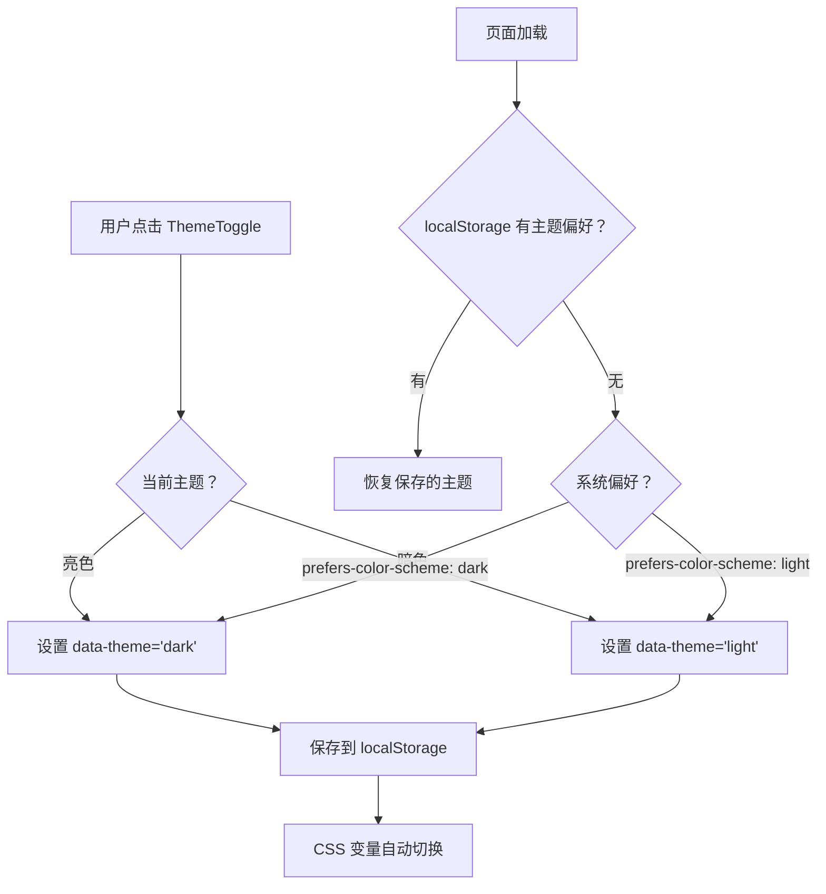
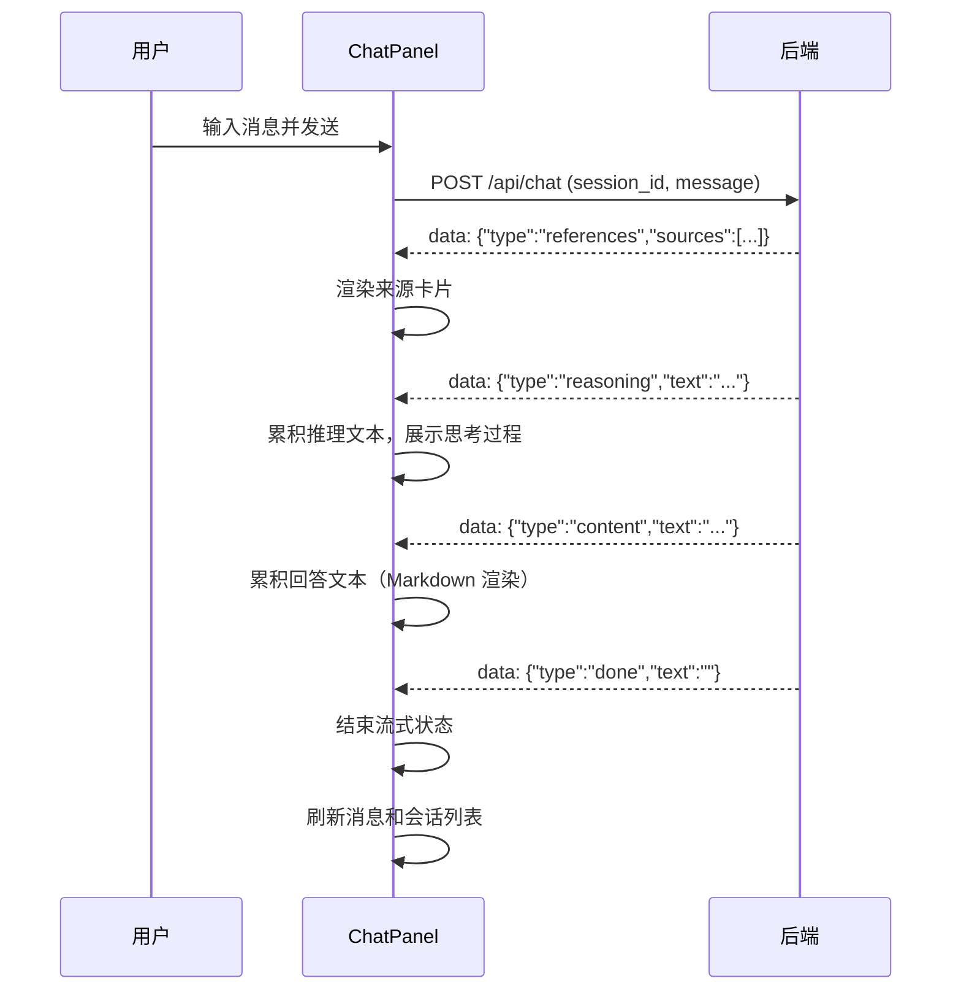
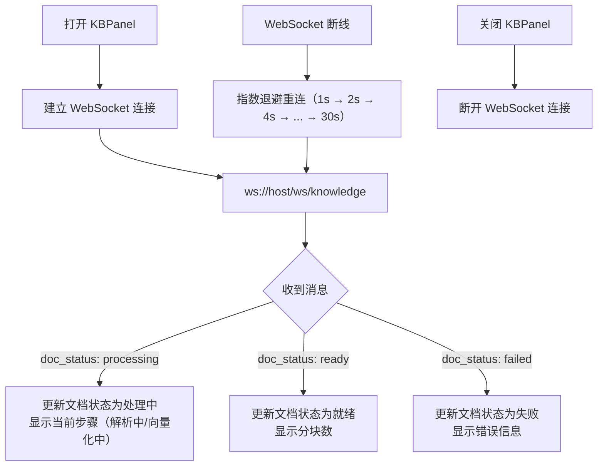

# 前端详细设计

## 一、概述

基于 `页面原型/Web-Prototype/ai-chat-assistant.html` 的浮动面板设计，使用 React 18 + Vite + TypeScript 实现生产级前端。与后端通过 REST API + SSE + WebSocket 通信。

**设计风格**：暖色调浅色主题（`#f5f4ed` 背景），衬线标题字体，圆角胶囊式 UI 元素，右侧滑出面板布局。支持亮色/暗色双主题。

---

## 二、技术栈

| 层面 | 选型 | 说明 |
|------|------|------|
| 框架 | React 18 + Vite | 组件化，HMR 开发体验 |
| 语言 | TypeScript | 类型安全 |
| 样式 | CSS Modules + CSS 变量 | 原型 token 直接平移，支持暗色主题切换 |
| Markdown | react-markdown + remark-gfm | 支持表格/代码/列表 |
| 代码高亮 | react-syntax-highlighter | 配合代码块 |
| SSE | 原生 fetch + ReadableStream | 后端 SSE 格式 |
| WebSocket | 原生 WebSocket | 文档处理状态推送 |
| 状态管理 | React Context + useReducer | 轻量级 |
| HTTP | 原生 fetch | 接口不多 |

---

## 三、项目结构

```
frontend/
├── index.html
├── vite.config.ts
├── tsconfig.json
├── package.json
├── .env                        # VITE_API_BASE_URL
├── src/
│   ├── main.tsx                # 入口
│   ├── App.tsx                 # 主组件
│   ├── App.module.css
│   ├── api/
│   │   ├── client.ts           # fetch 封装
│   │   ├── sessions.ts         # 会话 CRUD
│   │   ├── chat.ts             # SSE 流式对话
│   │   ├── knowledge.ts        # 知识库接口
│   │   ├── stats.ts            # 统计接口
│   │   └── ws.ts               # WebSocket 连接
│   ├── components/
│   │   ├── TopBar.tsx           # 浮动 Tab 栏
│   │   ├── TopBar.module.css
│   │   ├── Sidebar.tsx          # 会话列表
│   │   ├── Sidebar.module.css
│   │   ├── ChatPanel/
│   │   │   ├── ChatPanel.tsx    # 对话主区域
│   │   │   ├── ChatEmpty.tsx    # 空状态 + 快捷提示
│   │   │   ├── MessageItem.tsx  # 消息渲染（静态 + 流式）
│   │   │   ├── InputArea.tsx    # 浮动输入框
│   │   │   └── *.module.css
│   │   ├── KBPanel/
│   │   │   ├── KBPanel.tsx      # 知识库面板
│   │   │   ├── DocSearch.tsx    # 文档搜索
│   │   │   ├── DocTable.tsx     # 文档列表表格
│   │   │   └── KBPanel.module.css
│   │   ├── StatsPanel/
│   │   │   ├── StatsPanel.tsx   # 统计面板
│   │   │   └── StatsPanel.module.css
│   │   └── shared/
│   │       ├── Panel.tsx        # 通用滑出面板
│   │       ├── ThemeToggle.tsx  # 主题切换按钮
│   │       └── Panel.module.css
│   ├── context/
│   │   └── AppContext.tsx       # 全局状态
│   ├── hooks/
│   │   └── useTheme.ts         # 主题 hook
│   ├── styles/
│   │   ├── tokens.css           # 设计 token（亮色 + 暗色）
│   │   └── dark.css             # 暗色主题覆盖
│   └── types/
│       └── index.ts             # TypeScript 类型
└── dist/                        # 构建产物
```

---

## 四、设计 Token

从原型平移的 CSS 变量，集中在 `tokens.css`，支持亮色/暗色双主题。

### 4.1 亮色主题（默认）

**颜色**

| Token | 值 | 用途 |
|-------|---|------|
| `--bg` | `#f5f4ed` | 页面背景 |
| `--surface` | `#faf9f5` | 面板/卡片背景 |
| `--surface-warm` | `#e8e6dc` | 次级表面（激活态、推理块） |
| `--fg` | `#141413` | 主文本 |
| `--fg-2` | `#3d3d3a` | 次级文本 |
| `--muted` | `#5e5d59` | 弱化文本 |
| `--meta` | `#87867f` | 元信息/占位符 |
| `--border` | `#f0eee6` | 主边框 |
| `--accent` | `#c96442` | 主强调色（按钮、链接） |
| `--success` | `#17a34a` | 成功态 |
| `--warn` | `#eab308` | 警告态 |
| `--danger` | `#b53333` | 错误态 |

### 4.2 暗色主题

| Token | 值 | 用途 |
|-------|---|------|
| `--bg` | `#1a1a1a` | 页面背景 |
| `--surface` | `#252525` | 面板/卡片背景 |
| `--surface-warm` | `#2e2e2e` | 次级表面（激活态、推理块） |
| `--fg` | `#e8e6dc` | 主文本 |
| `--fg-2` | `#b0ada4` | 次级文本 |
| `--muted` | `#87867f` | 弱化文本 |
| `--meta` | `#6b6a65` | 元信息/占位符 |
| `--border` | `#3a3a38` | 主边框 |
| `--accent` | `#d4785a` | 主强调色（按钮、链接，亮度提升） |
| `--success` | `#22c55e` | 成功态 |
| `--warn` | `#fbbf24` | 警告态 |
| `--danger` | `#ef4444` | 错误态 |

### 4.3 通用 Token

**字体**

| Token | 值 |
|-------|---|
| `--font-display` | Georgia, "Times New Roman", serif |
| `--font-body` | Georgia, "Times New Roman", serif |
| `--font-mono` | ui-monospace, "JetBrains Mono", Menlo, monospace |

**间距**：`--space-1`(4px) 到 `--space-12`(48px)，4px 递增

**圆角**：`--radius-sm`(8px), `--radius-md`(12px), `--radius-lg`(16px)

**动效**：`--motion-fast`(150ms), `--motion-base`(200ms), `--ease`(cubic-bezier(0.2, 0, 0, 1))

### 4.4 主题切换机制



**实现方式**：
- 在 `<html>` 标签上设置 `data-theme` 属性
- `tokens.css` 用 `[data-theme="dark"]` 选择器覆盖暗色变量
- 组件只需使用 `var(--xxx)` 变量，无需关心当前主题
- `useTheme` hook 管理主题状态和 localStorage 持久化

---

## 五、组件设计

### 5.1 Panel（通用滑出面板）

**职责**：可复用的右侧面板容器，支持滑入/滑出动画。

**Props**：`isOpen`, `onClose`, `title`, `sidebar?`, `children`

**交互**：
- CSS `transform: translateX()` 实现滑入/滑出
- ESC 键关闭
- 点击面板内部阻止冒泡

### 5.2 TopBar（顶部浮动栏）

**职责**：Tab 切换 + 新会话按钮 + 主题切换。

**结构**：浮动药丸式 Tab 栏（对话/知识库/统计）+ 胶囊式"新会话"按钮 + ThemeToggle。

**交互**：
- 点击 Tab 切换对应面板（互斥，同时只开一个）
- 点击"新会话"创建会话并关闭所有面板
- ThemeToggle 切换亮色/暗色主题

### 5.3 Sidebar（会话列表面板）

**职责**：展示会话列表，支持切换和删除。

**数据来源**：`GET /api/sessions`

**交互**：
- 点击会话项 → 加载该会话消息
- 悬停显示删除按钮
- 活跃会话高亮

### 5.4 ChatPanel（对话主区域）

**职责**：核心对话界面，包含空状态、消息列表、输入框。

**子组件**：
- `ChatEmpty`：空状态 + 4 个烟草行业快捷提示
- `MessageItem`：user 消息（右对齐，accent 背景）/ AI 消息（左对齐，surface 背景 + 边框）
- `ReasoningBlock`：推理过程折叠区域
- `SourceCard`：引用来源卡片，点击展开 snippet
- `InputArea`：浮动药丸式输入框，textarea 自动伸缩

**SSE 流程**：



### 5.5 KBPanel（知识库面板）

**职责**：文档上传、列表展示、状态监控、文档搜索。

**子组件**：
- `UploadZone`：拖拽 + 点击上传
- `DocSearch`：搜索框，按文件名实时过滤文档列表，支持关键词高亮匹配
- `DocTable`：文件名、类型徽章（PDF/Word/图片/Markdown/HTML）、分块数、状态徽章（就绪/处理中/失败）

**文档计数**：
- 面板标题处显示文档总数徽章（如 "知识库 (15)"）
- 状态栏展示各状态统计：就绪 N / 处理中 N / 失败 N
- 失败文档提供"重试"按钮，调用 `POST /api/knowledge/documents/{id}/retry`

**搜索功能**：
- 搜索框位于文档列表上方，placeholder="搜索文档..."
- 前端实时过滤（基于 filename 字段的 includes 匹配）
- 搜索结果为零时显示空状态提示
- 搜索关键词在匹配的文件名中高亮显示

**WebSocket 实时状态**：



**状态徽章样式**：

| 状态 | 颜色 | 文字 |
|------|------|------|
| `processing` | `--warn`（黄色） | "处理中" + 当前步骤 |
| `ready` | `--success`（绿色） | "就绪" + 分块数 |
| `failed` | `--danger`（红色） | "失败" + 重试按钮 |

### 5.6 StatsPanel（统计面板）

**职责**：数据概览 + 热门问题。

**数据来源**：`GET /api/stats/overview` + `GET /api/stats/top-questions`

**展示**：
- 4 个统计卡片（总会话、总消息、文档数、命中率）
- 热门问题列表（前三名特殊颜色：accent/fg/fg-2）

### 5.7 ThemeToggle（主题切换按钮）

**职责**：切换亮色/暗色主题。

**交互**：
- 点击在亮色/暗色之间切换
- 亮色模式显示月亮图标，暗色模式显示太阳图标
- 切换动画：图标旋转过渡（150ms ease）
- 主题偏好保存到 localStorage

---

## 六、状态管理

使用 React Context + useReducer，全局单一状态树：

```typescript
interface AppState {
  sessions: Session[];            // 会话列表
  activeSessionId: string | null; // 当前活跃会话
  messages: Message[];            // 当前会话消息
  streaming: {                    // SSE 流式状态
    reasoning: string;
    content: string;
    sources: SourceInfo[];
    isActive: boolean;
  };
  docs: KnowledgeDoc[];           // 知识库文档
  docSearchQuery: string;         // 文档搜索关键词
  stats: StatsOverview | null;    // 统计数据
  hotQuestions: TopQuestion[];    // 热门问题
  theme: "light" | "dark";       // 当前主题
  panels: {                       // 面板开关
    sidebar: boolean;
    kb: boolean;
    stats: boolean;
  };
}
```

**Action 类型**：
- `SET_SESSIONS` / `SET_ACTIVE_SESSION` / `SET_MESSAGES`
- `APPEND_REASONING` / `APPEND_CONTENT` / `SET_SOURCES` / `SET_STREAMING_ACTIVE` / `RESET_STREAMING`
- `SET_DOCS` / `UPDATE_DOC_STATUS` / `ADD_DOCS` / `REMOVE_DOC`
- `SET_DOC_SEARCH_QUERY`
- `SET_STATS` / `SET_HOT_QUESTIONS`
- `SET_THEME`
- `TOGGLE_PANEL` / `CLOSE_ALL_PANELS`

---

## 七、API 对接

### 7.1 REST 接口映射

| 后端端点 | 前端函数 | 文件 | 触发时机 |
|---------|---------|------|---------|
| `POST /api/sessions` | `createSession()` | sessions.ts | 新会话/首次发消息 |
| `GET /api/sessions` | `fetchSessions()` | sessions.ts | 页面加载 + 发消息后 |
| `GET /api/sessions/{id}/messages` | `fetchMessages(id)` | sessions.ts | 切换会话 |
| `DELETE /api/sessions/{id}` | `deleteSession(id)` | sessions.ts | 删除会话 |
| `POST /api/chat` | `sendMessageSSE()` | chat.ts | 发送消息 |
| `POST /api/knowledge/upload` | `uploadFiles()` | knowledge.ts | 文件上传 |
| `GET /api/knowledge/documents` | `fetchDocs()` | knowledge.ts | 打开知识库面板 |
| `DELETE /api/knowledge/documents/{id}` | `deleteDoc(id)` | knowledge.ts | 删除文档 |
| `POST /api/knowledge/documents/{id}/retry` | `retryDoc(id)` | knowledge.ts | 重试失败文档 |
| `POST /api/knowledge/requeue-stuck` | `requeueStuck()` | knowledge.ts | 重排队卡住文档 |
| `GET /api/stats/overview` | `fetchStats()` | stats.ts | 打开统计面板 |
| `GET /api/stats/top-questions` | `fetchHotQuestions()` | stats.ts | 打开统计面板 |

### 7.2 SSE 流式处理

```typescript
// chat.ts
export async function sendMessageSSE(
  sessionId: string,
  message: string,
  callbacks: SSECallbacks,
): Promise<void> {
  const res = await fetch(apiUrl("/api/chat"), { method: "POST", ... });
  const reader = res.body!.getReader();
  // 逐行解析 data: {...}
  // references → onReferences
  // reasoning → onReasoning
  // content → onContent
  // done → onDone
  // error → onError
}
```

### 7.3 WebSocket 连接

```typescript
// ws.ts
export function connectKnowledgeWS(onMessage: (msg: DocStatusMsg) => void): WebSocket {
  const ws = new WebSocket(`${WS_BASE}/ws/knowledge`);
  ws.onmessage = (e) => onMessage(JSON.parse(e.data));
  ws.onclose = () => setTimeout(() => connectKnowledgeWS(onMessage), 3000); // 自动重连
  return ws;
}
```

---

## 八、后端改动

### 8.1 WebSocket 端点

新增 `ws://localhost:8000/ws/knowledge`，推送文档处理状态：

```json
{"type": "doc_status", "doc_id": 1, "status": "processing", "step": "解析中", "chunk_count": 0}
{"type": "doc_status", "doc_id": 1, "status": "processing", "step": "向量化中", "chunk_count": 5}
{"type": "doc_status", "doc_id": 1, "status": "ready", "step": "完成", "chunk_count": 12}
{"type": "doc_status", "doc_id": 1, "status": "failed", "step": "解析失败", "error": "..."}
```

### 8.2 重试与重排队端点

- `POST /api/knowledge/documents/{id}/retry` — 重试单个失败文档
- `POST /api/knowledge/requeue-stuck` — 批量重排队卡住文档（processing 超过 10 分钟）

**改动文件**：
- `app/api/knowledge.py` — 新增 WebSocket 端点 + 连接池管理 + retry/requeue 端点
- `app/services/knowledge.py` — 在处理各阶段调用广播函数
- `app/services/document_processor.py` — asyncio.Queue 文档处理队列
- `app/main.py` — 挂载 WebSocket 路由

---

## 九、开发计划

| 阶段 | 内容 | 状态 |
|------|------|------|
| P0 | 项目初始化 + token 迁移 + 骨架 | 已完成 |
| P1 | Panel + TopBar + Sidebar | 已完成 |
| P2 | ChatPanel（SSE + Markdown） | 已完成 |
| P3 | KBPanel（上传 + WebSocket + 搜索） | 已完成 |
| P4 | StatsPanel（统计 + 热门问题） | 已完成 |
| P5 | 暗色主题 + 联调 + 响应式 + 打磨 | 待做 |

---

## 十、联调验证

1. 启动后端：`cd backend && uv run uvicorn app.main:app --reload`
2. 启动前端：`cd frontend && npm run dev`
3. 测试流程：
   - 创建会话 → 发送消息 → 验证 SSE 流式渲染
   - 上传文档 → 验证 WebSocket 状态推送
   - 切换会话 → 验证消息历史加载
   - 打开统计 → 验证数据展示
   - 全链路：上传文档 → 等待 ready → 发送相关问题 → 验证 RAG 引用来源
   - 文档搜索：输入关键词 → 验证实时过滤和高亮
   - 失败重试：上传一个会失败的文件 → 验证重试按钮和状态恢复
   - 暗色主题：点击主题切换 → 验证所有组件颜色正确切换
