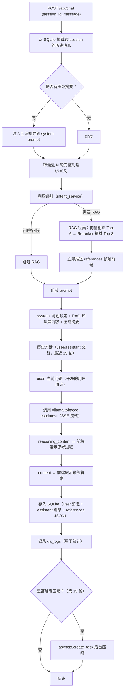
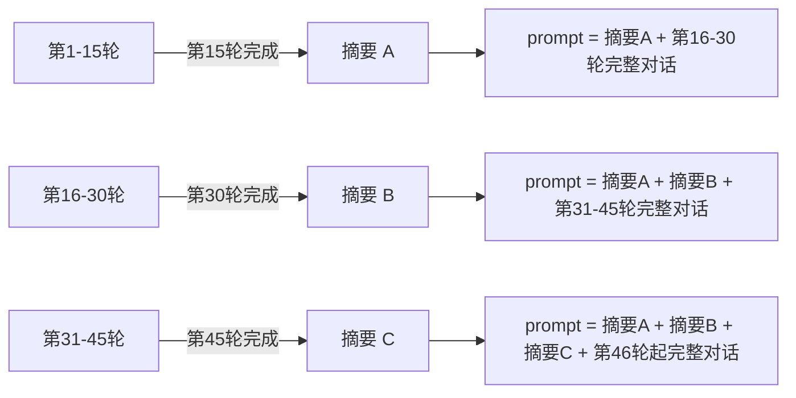
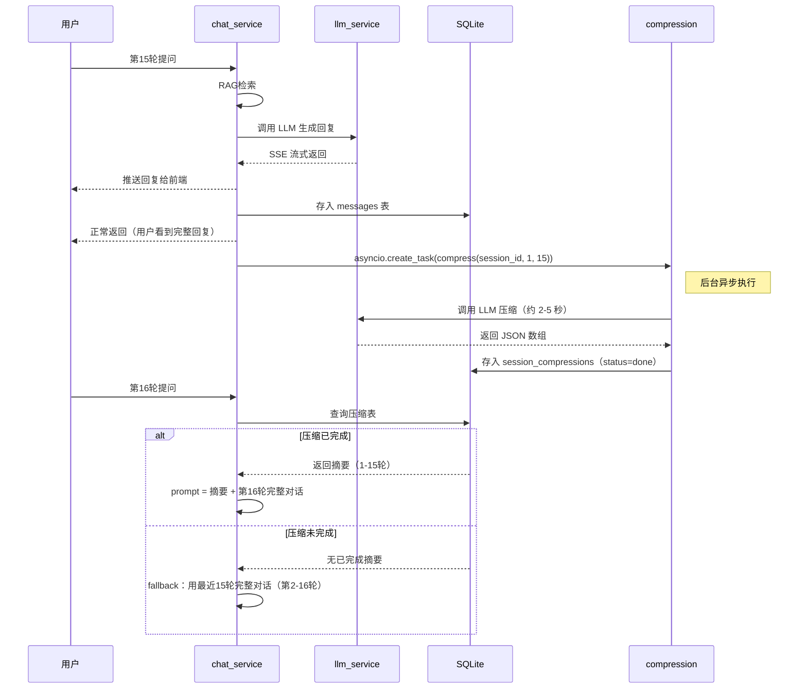
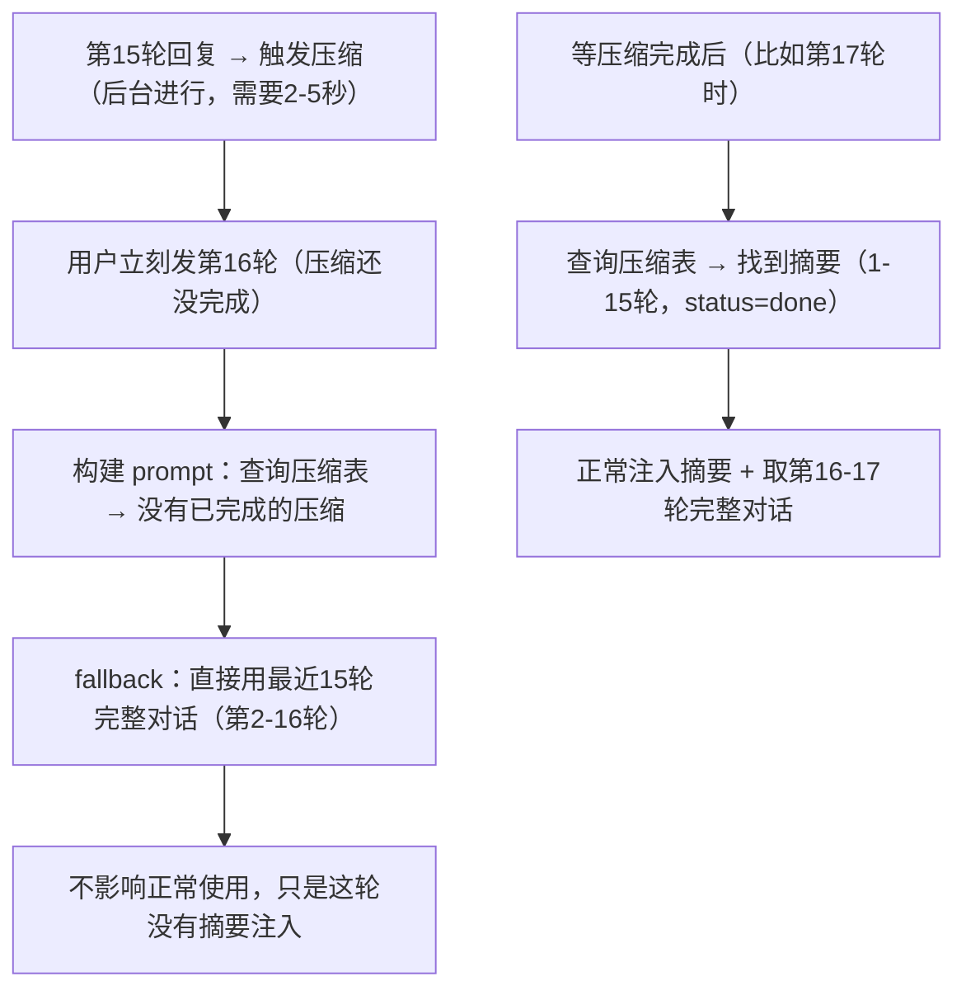
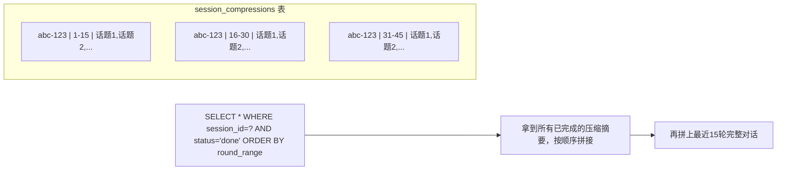
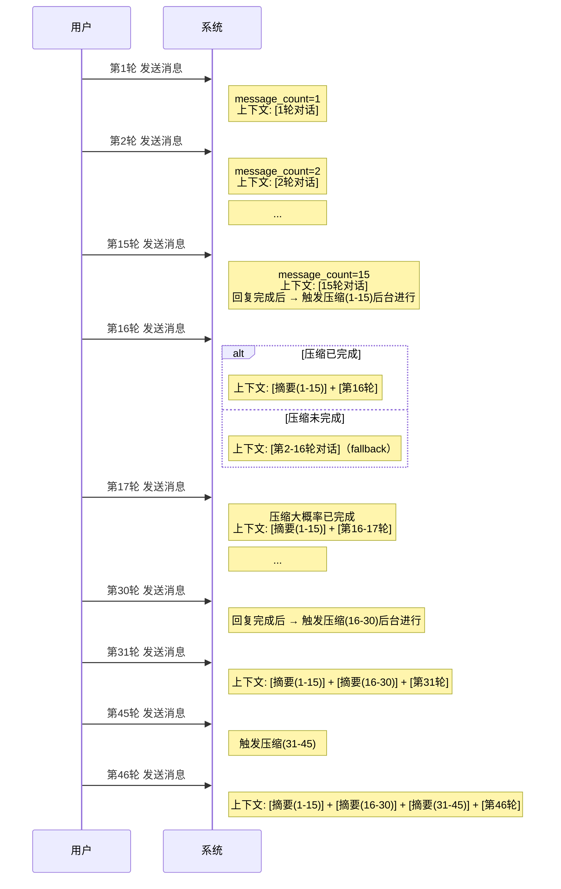
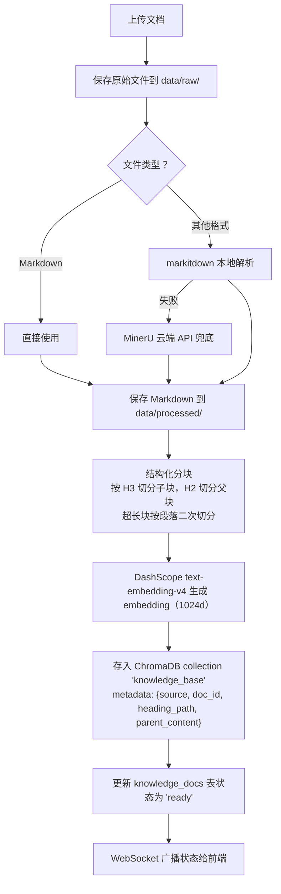
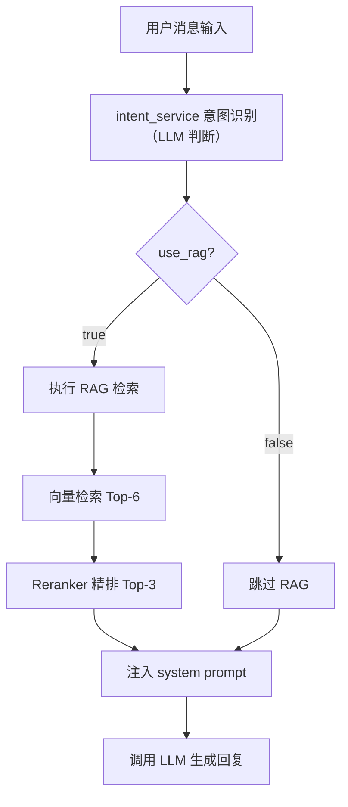
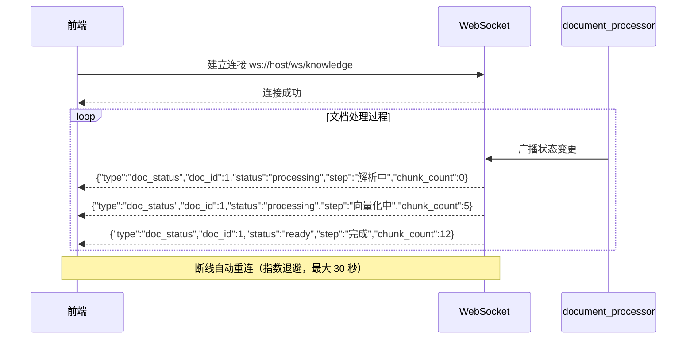
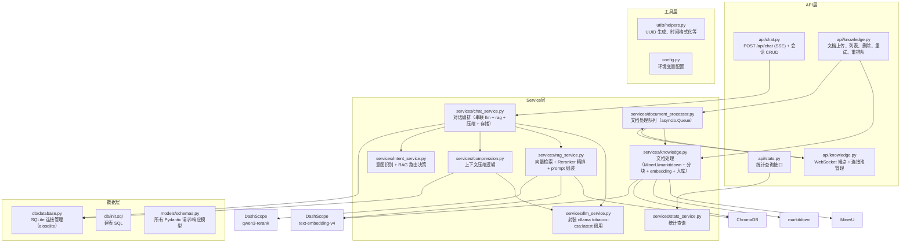

# 后端详细设计

## 一、整体代码逻辑流程

### 1.1 对话请求主流程



### 1.2 上下文压缩机制

#### 1.2.1 触发条件

```
触发时机：当前会话的 assistant 回复完成后，检查 message_count
触发条件：message_count % 15 == 0（第15、30、45...轮回复完成后）
```

#### 1.2.2 压缩什么

压缩的是**最老的一批未被压缩的消息**，不是全部历史。



#### 1.2.3 上下文组装方式

```python
messages = [
    {
        "role": "system",    # 唯一一个 system message，内部按区块组织
        "content":
            "[角色设定]\n你是烟草行业智能客服助手...\n\n"
            "[知识库检索结果]\n文档1: ...\n文档2: ...\n\n"
            "[上下文摘要]\n第1-15轮: 1. 用户问了焦油量...\n第16-30轮: ..."
    },
    {"role": "user", "content": "第N-14轮问题"},       # 对话历史
    {"role": "assistant", "content": "第N-14轮回答"},
    ...
    {"role": "user", "content": "当前问题"}             # 干净的用户原话
]
```

**一个 system message，对话历史用标准 user/assistant 交替。**

**最近完整对话的窗口大小：**
- 无压缩摘要时：保留最近 15 轮
- 有压缩摘要时：保留最近 15 轮（从最新消息往前取）
- 所以 prompt 中最多出现：所有历史摘要 + 最近 15 轮完整对话

#### 1.2.4 压缩 Prompt

```
请将以下多轮对话压缩为话题摘要列表。

要求：
1. 每轮对话（一问一答）压缩为一个话题
2. 每个话题不超过50个字
3. 保留关键信息：用户问了什么、得到了什么关键结论/数据
4. 按对话顺序输出
5. 严格输出JSON数组，不要输出其他内容

对话内容：
第1轮：
User: {msg}
Assistant: {msg}

第2轮：
User: {msg}
Assistant: {msg}

...

第15轮：
User: {msg}
Assistant: {msg}

输出格式（严格JSON数组）：
["话题1摘要", "话题2摘要", ...]
```

#### 1.2.5 异步压缩时序



#### 1.2.6 关键问题：压缩未完成时怎么办

如果用户在第15轮回复后立刻发第16轮消息，压缩可能还没完成：



**结论：压缩未完成不影响正常对话，只是暂时没有摘要注入，用完整对话兜底。**

#### 1.2.7 多次压缩的累积



#### 1.2.8 压缩状态表设计

```sql
CREATE TABLE session_compressions (
    id INTEGER PRIMARY KEY AUTOINCREMENT,
    session_id TEXT NOT NULL,
    compressed_topics TEXT NOT NULL,       -- JSON: ["话题1", "话题2", ...]
    round_start INTEGER NOT NULL,          -- 起始轮次（如 1）
    round_end INTEGER NOT NULL,            -- 结束轮次（如 15）
    status TEXT DEFAULT 'pending'          -- pending / done / failed
        CHECK(status IN ('pending', 'done', 'failed')),
    created_at TIMESTAMP DEFAULT CURRENT_TIMESTAMP,
    FOREIGN KEY (session_id) REFERENCES sessions(id) ON DELETE CASCADE
);
```

**status 说明：**
- `pending`：压缩任务已提交，正在执行
- `done`：压缩完成，摘要可注入 prompt
- `failed`：压缩失败（模型调用异常等），不影响正常对话

#### 1.2.9 完整时序图



### 1.3 知识库构建流程



### 1.4 意图识别与 RAG 路由



**意图分类规则（基于 LLM 判断）：**

使用主 LLM（tobacco-csa）进行意图识别，输入用户原始消息和结合上下文后的检索问题，输出 `{"use_rag": true/false}`。

| 意图 | 判断条件 | RAG 策略 |
|------|---------|---------|
| 知识问答 | 询问烟草产品参数、价格、焦油量、真假鉴别、许可证、经营规范等 | RAG 检索（Top-6 → Rerank Top-3） |
| 闲聊/问候 | 问候、寒暄、感谢、告别、自我介绍 | 跳过 RAG |
| 追问 | 短句追问，结合上一轮仍在问烟草事实 | RAG 检索（同上） |

**降级策略：** 意图识别失败时，默认走 RAG 检索。

## 二、数据结构

### 2.1 SQLite 表结构

```sql
-- 会话表
CREATE TABLE sessions (
    id TEXT PRIMARY KEY,                              -- UUID
    title TEXT NOT NULL DEFAULT '新对话',              -- 首条用户消息截取前20字
    message_count INTEGER DEFAULT 0,                  -- 消息轮次计数
    created_at TIMESTAMP DEFAULT CURRENT_TIMESTAMP,
    updated_at TIMESTAMP DEFAULT CURRENT_TIMESTAMP
);

-- 消息表
CREATE TABLE messages (
    id INTEGER PRIMARY KEY AUTOINCREMENT,
    session_id TEXT NOT NULL,
    role TEXT NOT NULL CHECK(role IN ('user', 'assistant')),
    content TEXT NOT NULL,
    reasoning_content TEXT,                            -- 推理过程（仅 assistant）
    references TEXT,                                   -- 引用来源 JSON（仅 assistant）
    created_at TIMESTAMP DEFAULT CURRENT_TIMESTAMP,
    FOREIGN KEY (session_id) REFERENCES sessions(id) ON DELETE CASCADE
);

-- 压缩摘要表
CREATE TABLE session_compressions (
    id INTEGER PRIMARY KEY AUTOINCREMENT,
    session_id TEXT NOT NULL,
    compressed_topics TEXT NOT NULL,                   -- JSON: ["话题1", "话题2", ...]
    round_start INTEGER NOT NULL,                      -- 起始轮次（如 1）
    round_end INTEGER NOT NULL,                        -- 结束轮次（如 15）
    status TEXT DEFAULT 'pending'                      -- pending/done/failed
        CHECK(status IN ('pending', 'done', 'failed')),
    created_at TIMESTAMP DEFAULT CURRENT_TIMESTAMP,
    FOREIGN KEY (session_id) REFERENCES sessions(id) ON DELETE CASCADE
);

-- 问答日志（统计用）
CREATE TABLE qa_logs (
    id INTEGER PRIMARY KEY AUTOINCREMENT,
    session_id TEXT NOT NULL,
    user_question TEXT NOT NULL,
    retrieved_doc_ids TEXT,                            -- JSON: 命中的文档chunk id列表
    max_similarity REAL,                               -- 最高相似度分数
    kb_hit INTEGER DEFAULT 0,                          -- 1=命中 0=未命中
    response_time_ms INTEGER,                          -- 响应耗时
    created_at TIMESTAMP DEFAULT CURRENT_TIMESTAMP,
    FOREIGN KEY (session_id) REFERENCES sessions(id) ON DELETE CASCADE
);

-- 知识库文档记录
CREATE TABLE knowledge_docs (
    id INTEGER PRIMARY KEY AUTOINCREMENT,
    filename TEXT NOT NULL,
    file_type TEXT NOT NULL,                           -- pdf/word/image/markdown/html
    chunk_count INTEGER DEFAULT 0,
    status TEXT DEFAULT 'processing' CHECK(status IN ('processing', 'ready', 'failed')),
    error_msg TEXT,
    created_at TIMESTAMP DEFAULT CURRENT_TIMESTAMP
);
```

### 2.2 Pydantic 模型

```python
# --- 请求模型 ---

class ChatRequest(BaseModel):
    session_id: str
    message: str

class SessionCreate(BaseModel):
    title: str | None = None        # 可选，不传则自动生成

class KnowledgeUpload(BaseModel):
    files: list[UploadFile]

# --- 响应模型 ---

class SourceInfo(BaseModel):          # 引用来源
    index: int                        # 编号 [1] [2] [3]
    title: str                        # 文档标题（取 heading_path 最后一级）
    filename: str                     # 源文件名
    content: str                      # 命中的子块内容（截取前200字）

class ChatChunk(BaseModel):          # SSE 流式返回的每一帧
    type: Literal["reasoning", "content", "references", "done"]
    text: str = ""
    sources: list[SourceInfo] | None = None  # 仅 type=references 时有值

class SessionInfo(BaseModel):
    id: str
    title: str
    message_count: int
    created_at: str
    updated_at: str

class MessageInfo(BaseModel):
    id: int
    role: str
    content: str
    reasoning_content: str | None
    references: list[SourceInfo] | None   # 仅 assistant 消息有值
    created_at: str

class KnowledgeDocInfo(BaseModel):
    id: int
    filename: str
    file_type: str
    chunk_count: int
    status: str
    created_at: str

class StatsOverview(BaseModel):
    total_sessions: int
    total_messages: int
    total_docs: int
    kb_hit_rate: float              # 知识库命中率百分比

class TopQuestion(BaseModel):
    question: str
    count: int
```

### 2.3 ChromaDB 结构

> 详见 [RAG设计文档](./RAG设计文档.md) 第五节

## 三、API 详细设计

### 3.1 对话 API

#### `POST /api/chat` — 发送消息（SSE 流式）

```
请求：
{
    "session_id": "uuid-xxx",
    "message": "黄鹤楼硬蓝的焦油量是多少？"
}

响应：text/event-stream
data: {"type": "references", "sources": [           ← RAG 检索完成后立即推送
    {"index": 1, "title": "黄鹤楼产品参数表", "filename": "huanghelou.pdf", "content": "焦油量：10mg..."},
    {"index": 2, "title": "卷烟分类标准", "filename": "classification.md", "content": "烤烟型卷烟是指..."}
]}
data: {"type": "reasoning", "text": "用户询问..."}   ← LLM 开始生成
data: {"type": "reasoning", "text": "让我检索..."}
data: {"type": "content", "text": "根据"}
data: {"type": "content", "text": "知识库"}
data: {"type": "content", "text": "信息..."}
data: {"type": "done", "text": ""}
```

**逻辑：**
1. 存用户消息到 messages 表
2. 加载历史 + 压缩摘要
3. 意图识别 → 判断是否需要 RAG
4. RAG 检索 → 向量粗筛 Top-6 → Reranker 精排 Top-3
5. **立即推送 references 帧**（title、filename、content）给前端
6. 组装 prompt，调 ollama tobacco-csa:latest stream
7. 逐 chunk 推 SSE（reasoning / content）给前端
8. 完整回复存 messages 表（含 references JSON）
9. 记录 qa_logs（含命中的 doc_id 列表）
10. 检查是否触发压缩

#### `GET /api/sessions` — 会话列表

```
响应：
[
    {
        "id": "uuid-xxx",
        "title": "黄鹤楼硬蓝的焦油量",
        "message_count": 6,
        "created_at": "2025-06-25T10:00:00",
        "updated_at": "2025-06-25T10:05:00"
    },
    ...
]
```

#### `POST /api/sessions` — 创建会话

```
请求：{} (空 body，或可选 {"title": "自定义标题"})

响应：
{
    "id": "uuid-xxx",
    "title": "新对话",
    "message_count": 0,
    "created_at": "...",
    "updated_at": "..."
}
```

#### `GET /api/sessions/{id}/messages` — 获取历史消息

```
响应：
[
    {
        "id": 1,
        "role": "user",
        "content": "黄鹤楼硬蓝的焦油量是多少？",
        "reasoning_content": null,
        "created_at": "..."
    },
    {
        "id": 2,
        "role": "assistant",
        "content": "根据知识库信息...",
        "reasoning_content": "用户询问...",
        "created_at": "..."
    },
    ...
]
```

#### `DELETE /api/sessions/{id}` — 删除会话

```
响应：204 No Content
```
级联删除 messages、session_compressions、qa_logs 中该 session 的数据。

### 3.2 知识库 API

#### `POST /api/knowledge/upload` — 上传文档

```
请求：multipart/form-data
files: [file1.pdf, file2.docx, ...]

响应：
{
    "message": "3 个文件已提交处理",
    "docs": [
        {"id": 1, "filename": "file1.pdf", "status": "processing"},
        {"id": 2, "filename": "file2.docx", "status": "processing"},
        {"id": 3, "filename": "file3.md", "status": "processing"}
    ]
}
```

**逻辑：**
1. 保存文件到 `data/raw/`
2. 插入 knowledge_docs 记录（status=processing）
3. 后台任务：markitdown 解析（失败则 MinerU 兜底）→ 分块 → embedding → 入 ChromaDB
4. 更新 status=ready 和 chunk_count
5. WebSocket 广播状态变更给前端

#### `GET /api/knowledge/documents` — 文档列表

```
响应：
[
    {
        "id": 1,
        "filename": "烟草专卖法.pdf",
        "file_type": "pdf",
        "chunk_count": 45,
        "status": "ready",
        "created_at": "..."
    },
    ...
]
```

#### `DELETE /api/knowledge/documents/{id}` — 删除文档

```
响应：204 No Content
```
同时从 ChromaDB 中删除该文档的所有 chunk（通过 metadata 过滤 doc_id）。

#### `POST /api/knowledge/retry-failed` — 重试所有失败文档

重新处理所有 `status=failed` 的文档。将状态重置为 `processing` 并重新入队。

```
响应：
{
    "message": "已重新提交 3 个文档",
    "retried": 3
}
```

**逻辑：**
1. 查询所有 status=failed 的文档
2. 将 status 重置为 processing
3. 逐个重新提交到 `document_processor` 队列
4. 返回重新提交的数量

#### `POST /api/knowledge/requeue-stuck` — 重新入队卡住文档

将卡在 `status=processing` 状态的文档重新入队。适用于后端重启后内存队列丢失的情况。

```
响应：
{
    "message": "已重新入队 2 个文档",
    "requeued": 2
}
```

**逻辑：**
1. 查询所有 status=processing 的文档
2. 逐个重新提交到处理队列
3. 返回重新入队的数量
3. WebSocket 广播状态变更

### 3.3 统计 API

#### `GET /api/stats/overview` — 总览

```
响应：
{
    "total_sessions": 42,
    "total_messages": 356,
    "total_docs": 15,
    "kb_hit_rate": 78.5
}
```

kb_hit_rate = qa_logs 中 kb_hit=1 的比例 × 100

#### `GET /api/stats/top-questions?limit=10` — 最常问问题

```
响应：
[
    {"question": "黄鹤楼硬蓝的焦油量", "count": 12},
    {"question": "烟草专卖许可证办理", "count": 8},
    ...
]
```

**聚类逻辑：**
- 取最近 7 天的 qa_logs
- 对 user_question 做文本相似度聚类（或简单用精确匹配 + 去重）
- 按出现次数降序排列

### 3.4 WebSocket API

#### `WS /ws/knowledge` — 文档处理状态推送



**消息格式：**

```json
{"type": "doc_status", "doc_id": 1, "status": "processing", "step": "解析中", "chunk_count": 0}
{"type": "doc_status", "doc_id": 1, "status": "processing", "step": "向量化中", "chunk_count": 5}
{"type": "doc_status", "doc_id": 1, "status": "ready", "step": "完成", "chunk_count": 12}
{"type": "doc_status", "doc_id": 1, "status": "failed", "step": "解析失败", "error": "..."}
```

## 四、Prompt 模板

### 4.1 对话 System Prompt

> 详见 [RAG设计文档](./RAG设计文档.md) 第七节

### 4.2 上下文压缩 Prompt

```
请将以下多轮对话压缩为话题摘要列表。

要求：
1. 每轮对话（一问一答）压缩为一个话题
2. 每个话题不超过50个字
3. 保留关键信息（问题核心、关键数据、结论）
4. 按对话顺序输出

对话内容：
第1轮：
User: {msg}
Assistant: {msg}

第2轮：
User: {msg}
Assistant: {msg}

...

请输出JSON数组格式：
["话题1摘要", "话题2摘要", ...]
```

## 五、关键代码模块职责



### 各模块职责：

| 模块 | 输入 | 输出 | 依赖 |
|------|------|------|------|
| `llm_service` | messages 列表 | SSE chunk 流 | ollama tobacco-csa:latest |
| `rag_service` | 用户问题文本 | top-k 父块内容 + 精排分数 | ChromaDB, DashScope text-embedding-v4, DashScope qwen3-rerank |
| `chat_service` | session_id + message | SSE chunk 流 | llm_service, rag_service, compression, intent_service, db |
| `compression` | session_id, round_start, round_end | None（异步写入DB） | llm_service, db |
| `knowledge` | 文件 | None（异步处理） | markitdown（默认）, MinerU（兜底）, ChromaDB, DashScope text-embedding-v4 |
| `stats_service` | 无 | 统计数据 | db |
| `intent_service` | 用户消息文本 | use_rag 布尔值 | llm_service（用主 LLM 做意图判断） |
| `document_processor` | 文档任务 | None（队列消费） | knowledge service, WebSocket 广播 |

## 六、配置项

```python
# config.py（默认值，.env 覆盖）

# LLM（锁死本地 Ollama 微调模型，不可通过 .env 修改）
LLM_BASE_URL = "http://localhost:11434/v1"
LLM_API_KEY = "ollama"
LLM_MODEL = "tobacco-csa:latest"
LLM_MAX_TOKENS = int(os.getenv("LLM_MAX_TOKENS", "2048"))
LLM_TEMPERATURE = float(os.getenv("LLM_TEMPERATURE", "0.7"))

# DashScope RAG APIs（共享 API Key）
DASHSCOPE_API_KEY = os.getenv("DASHSCOPE_API_KEY", "")
DASHSCOPE_TIMEOUT = float(os.getenv("DASHSCOPE_TIMEOUT", "30"))

# Embedding（DashScope text-embedding-v4，1024 维）
DASHSCOPE_EMBEDDING_BASE_URL = os.getenv("DASHSCOPE_EMBEDDING_BASE_URL", "https://dashscope.aliyuncs.com/compatible-mode/v1")
DASHSCOPE_EMBEDDING_MODEL = os.getenv("DASHSCOPE_EMBEDDING_MODEL", "text-embedding-v4")
DASHSCOPE_EMBEDDING_DIMENSIONS = int(os.getenv("DASHSCOPE_EMBEDDING_DIMENSIONS", "1024"))
DASHSCOPE_EMBEDDING_BATCH_SIZE = min(int(os.getenv("DASHSCOPE_EMBEDDING_BATCH_SIZE", "10")), 10)

# Reranker（DashScope qwen3-rerank）
DASHSCOPE_RERANK_BASE_URL = os.getenv("DASHSCOPE_RERANK_BASE_URL", "https://dashscope.aliyuncs.com/compatible-api/v1")
DASHSCOPE_RERANK_MODEL = os.getenv("DASHSCOPE_RERANK_MODEL", "qwen3-rerank")

# RAG 参数（.env 覆盖为 6 和 3）
RAG_RETRIEVAL_TOP_K = int(os.getenv("RAG_RETRIEVAL_TOP_K", "20"))
RAG_RERANK_TOP_K = int(os.getenv("RAG_RERANK_TOP_K", "5"))
RAG_RERANK_THRESHOLD = float(os.getenv("RAG_RERANK_THRESHOLD", "0.3"))

# 上下文压缩
COMPRESSION_ROUND_INTERVAL = 15             # 每15轮触发压缩
COMPRESSION_MAX_TOPIC_LENGTH = 50           # 每个话题≤50字

# MinerU
MINERU_TOKEN = os.getenv("MINERU_TOKEN", "")

# 文件存储
DATA_DIR = Path(os.getenv("DATA_DIR", "./data"))
RAW_DIR = DATA_DIR / "raw"
PROCESSED_DIR = DATA_DIR / "processed"

# ChromaDB
CHROMA_PERSIST_DIR = str(DATA_DIR / "chroma")
CHROMA_COLLECTION = "knowledge_base"

# 数据库
SQLITE_DB_PATH = str(DATA_DIR / "chat.db")

# 文档处理队列
DOC_QUEUE_MAX_SIZE = int(os.getenv("DOC_QUEUE_MAX_SIZE", "50"))
DOC_PROCESS_TIMEOUT = int(os.getenv("DOC_PROCESS_TIMEOUT", "300"))  # 秒
DOC_STUCK_THRESHOLD = int(os.getenv("DOC_STUCK_THRESHOLD", "600"))  # 秒，超过视为卡住
```
