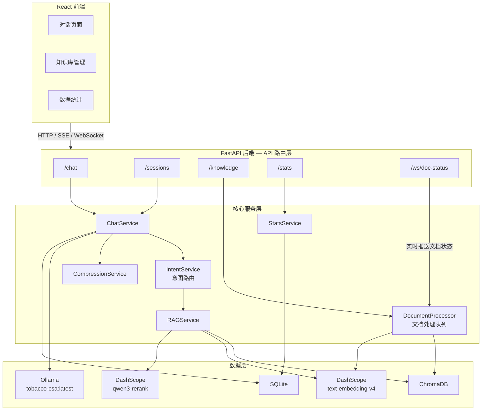
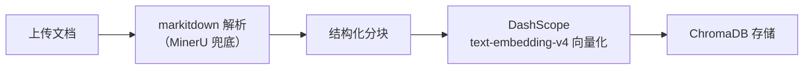
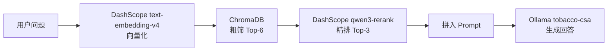
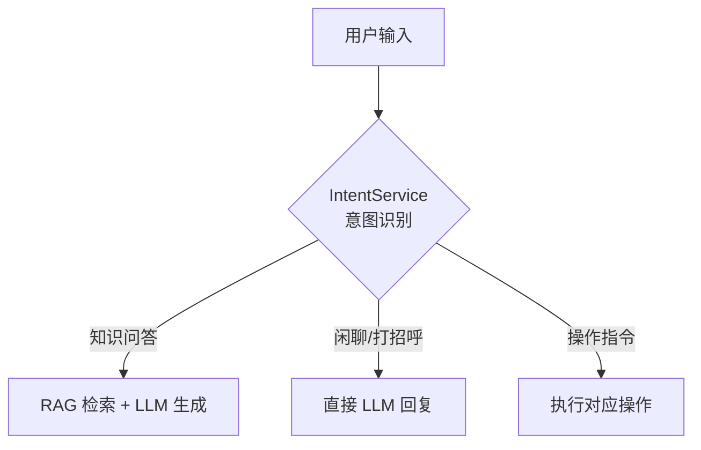
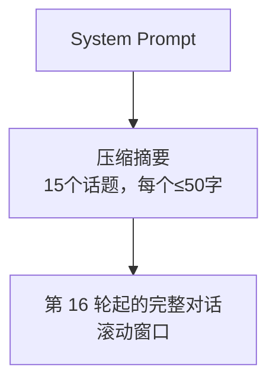
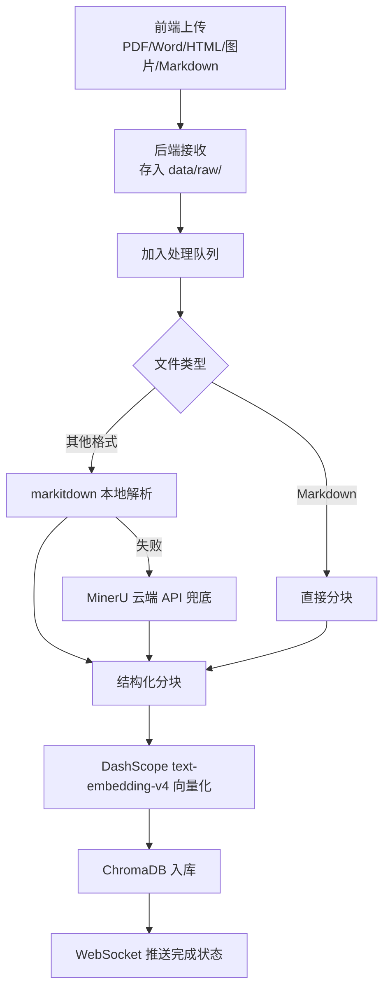
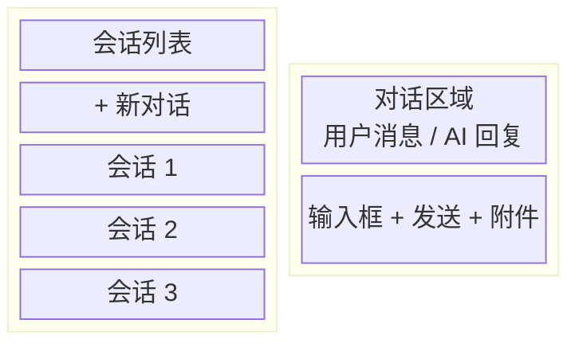

# 烟草智能客服系统 — 技术设计文档

## 一、系统架构



## 二、技术栈

| 层面 | 选型 | 说明 |
|------|------|------|
| 语言 | Python 3.11+ | uv 管理 |
| 后端框架 | FastAPI | 异步、自带 OpenAPI 文档 |
| LLM | Ollama `tobacco-csa:latest` | 本地部署，OpenAI 兼容 API |
| RAG | LangChain + ChromaDB | 文档分块 → 向量化 → 检索 |
| 文档解析 | markitdown（微软，默认） | HTML/PDF/DOCX/图片 → Markdown，本地解析 |
| 文档解析 | MinerU (Standard API，兜底) | PDF/Word/图片 → Markdown，需 Token |
| Embedding | DashScope `text-embedding-v4` (1024 维) | 阿里云 API 调用 |
| Reranker | DashScope `qwen3-rerank` | 粗排后精排，提升检索精度 |
| 意图路由 | `intent_service.py` | 用户意图识别，分流 RAG / 闲聊 |
| 前端 | React + Vite | 参考 ChatGPT 风格 |
| 数据库 | SQLite | 对话历史 + 统计数据 |
| 实时通信 | WebSocket | 文档处理状态实时推送 |
| 部署 | Docker Compose | 前后端 + 向量库一体化 |

## 三、核心模块设计

### 3.1 RAG 问答

> 详见 [RAG设计文档](./RAG设计文档.md)

**知识库构建流程：**



**检索流程：**



### 3.2 意图路由

`intent_service.py` 负责识别用户意图，将请求分流到不同处理路径：



**意图分类：**
- **知识问答** — 涉及烟草行业专业问题，走 RAG 流程
- **闲聊** — 日常寒暄、无关问题，直接调用 LLM
- **操作指令** — 如"删除会话"、"查看统计"等，路由到对应 API

### 3.3 多轮对话与上下文压缩

**正常轮次（1-14轮）：**
- 直接保留完整对话历史

**第 15 轮触发压缩：**
- 第 15 轮回复正常生成并返回
- 同时异步调用压缩模型（后台任务）
- 压缩内容：15 轮对话 → 15 个话题摘要，每个 ≤50 字

**压缩后的上下文结构：**



**压缩 Prompt 示例：**
```
请将以下对话压缩为话题摘要列表。每轮对话(user+assistant)压缩为一个话题，
每个话题不超过50字，保留关键信息。

对话内容：
User: ...
Assistant: ...
...

输出格式：
1. [话题摘要]
2. [话题摘要]
...
```

**实现方式：**
- 使用 Python `asyncio.create_task` 后台执行压缩
- 压缩结果存入 SQLite 的 `session_compression` 表
- 下一轮对话开始时检查是否有压缩结果，有则注入

### 3.4 文件上传与文档处理

**处理流程：**



**后台处理队列：**

`document_processor.py` 实现文档处理的后台队列管理：

- 文档上传后立即返回，处理在后台异步执行
- 队列状态：`pending` → `processing` → `ready` / `failed`
- 支持卡住任务检测（超时自动标记为 `stuck`）
- 通过 WebSocket 实时推送处理进度到前端

**重试与重排队列接口：**

```
POST /api/knowledge/documents/{id}/retry    # 重试失败的文档
POST /api/knowledge/documents/requeue-stuck  # 重新排队所有卡住的任务
```

### 3.5 数据统计

**统计指标：**
1. 最常问 Top N 问题 — 基于问题文本相似度聚类
2. 知识库命中率 — 检索结果相似度 > 阈值的比例

**实现：**
- 每次问答记录到 SQLite `qa_logs` 表
- 统计页面通过 SQL 聚合查询实现

### 3.6 对话历史

- 按 session_id 维度存储
- 匿名使用，无需登录
- SQLite 持久化，永久保留
- 前端左侧栏展示会话列表

## 四、数据库设计

### SQLite 表结构

```sql
-- 会话表
CREATE TABLE sessions (
    id TEXT PRIMARY KEY,          -- UUID
    title TEXT,                    -- 会话标题（首条消息截取）
    created_at TIMESTAMP DEFAULT CURRENT_TIMESTAMP,
    updated_at TIMESTAMP DEFAULT CURRENT_TIMESTAMP
);

-- 消息表
CREATE TABLE messages (
    id INTEGER PRIMARY KEY AUTOINCREMENT,
    session_id TEXT NOT NULL,
    role TEXT NOT NULL,            -- 'user' | 'assistant'
    content TEXT NOT NULL,
    created_at TIMESTAMP DEFAULT CURRENT_TIMESTAMP,
    FOREIGN KEY (session_id) REFERENCES sessions(id)
);

-- 压缩摘要表
CREATE TABLE session_compressions (
    id INTEGER PRIMARY KEY AUTOINCREMENT,
    session_id TEXT NOT NULL UNIQUE,
    compressed_topics TEXT NOT NULL,  -- JSON array of topic strings
    round_number INTEGER NOT NULL,    -- 压缩时的轮次
    created_at TIMESTAMP DEFAULT CURRENT_TIMESTAMP,
    FOREIGN KEY (session_id) REFERENCES sessions(id)
);

-- 问答日志（用于统计）
CREATE TABLE qa_logs (
    id INTEGER PRIMARY KEY AUTOINCREMENT,
    session_id TEXT NOT NULL,
    user_question TEXT NOT NULL,
    retrieved_docs TEXT,           -- JSON: 检索到的文档片段
    similarity_scores TEXT,        -- JSON: 相似度分数
    model_answer TEXT NOT NULL,
    response_time_ms INTEGER,
    created_at TIMESTAMP DEFAULT CURRENT_TIMESTAMP,
    FOREIGN KEY (session_id) REFERENCES sessions(id)
);

-- 知识库文档记录
CREATE TABLE knowledge_docs (
    id INTEGER PRIMARY KEY AUTOINCREMENT,
    filename TEXT NOT NULL,
    file_type TEXT NOT NULL,       -- pdf/word/image/markdown/html
    chunk_count INTEGER,
    status TEXT DEFAULT 'pending', -- pending/processing/ready/failed/stuck
    error_message TEXT,            -- 失败原因
    retry_count INTEGER DEFAULT 0,
    created_at TIMESTAMP DEFAULT CURRENT_TIMESTAMP,
    updated_at TIMESTAMP DEFAULT CURRENT_TIMESTAMP
);
```

## 五、API 设计

### 对话相关

```
POST   /api/chat                    # 发送消息（SSE 流式返回）
GET    /api/sessions                # 获取会话列表
POST   /api/sessions                # 创建新会话
GET    /api/sessions/{id}/messages  # 获取会话消息历史
DELETE /api/sessions/{id}           # 删除会话
```

### 知识库相关

```
POST   /api/knowledge/upload              # 上传文档
GET    /api/knowledge/documents           # 获取文档列表
DELETE /api/knowledge/documents/{id}      # 删除文档
POST   /api/knowledge/documents/{id}/retry       # 重试失败文档
POST   /api/knowledge/documents/requeue-stuck    # 重排卡住任务
```

### 统计相关

```
GET    /api/stats/overview          # 总览数据
GET    /api/stats/top-questions     # 最常问问题
GET    /api/stats/hit-rate          # 知识库命中率
```

### WebSocket

```
WS     /api/ws/doc-status           # 文档处理状态实时推送
```

## 六、前端页面设计

### 页面 1：对话页面（参考 ChatGPT）



### 页面 2：知识库管理

- 文档列表（名称、类型、状态、分块数）
- 上传区域（拖拽上传）
- 删除操作
- 实时状态更新（WebSocket 推送处理进度）

### 页面 3：数据统计

- 最常问问题 Top 10（表格/词云）
- 知识库命中率（百分比 + 趋势图）

## 七、项目结构

```
课设/
├── Docs/                          # 文档
│   ├── PRD.md
│   ├── 技术设计文档.md
│   ├── 后端详细设计.md
│   └── RAG设计文档.md
├── backend/                       # 后端
│   ├── app/
│   │   ├── __init__.py
│   │   ├── main.py               # FastAPI 入口
│   │   ├── config.py             # 配置管理
│   │   ├── api/
│   │   │   ├── chat.py           # 对话 API
│   │   │   ├── knowledge.py      # 知识库 API
│   │   │   └── stats.py          # 统计 API
│   │   ├── services/
│   │   │   ├── chat_service.py   # 对话服务
│   │   │   ├── intent_service.py # 意图路由
│   │   │   ├── rag_service.py    # RAG 检索服务
│   │   │   ├── llm_service.py    # LLM 调用封装
│   │   │   ├── compression.py    # 上下文压缩
│   │   │   ├── knowledge.py      # 知识库管理
│   │   │   ├── document_processor.py  # 文档处理队列
│   │   │   └── stats_service.py  # 统计服务
│   │   ├── models/
│   │   │   └── schemas.py        # Pydantic 模型
│   │   ├── db/
│   │   │   ├── database.py       # SQLite 连接
│   │   │   └── init.sql          # 建表脚本
│   │   └── utils/
│   │       └── helpers.py        # 工具函数
│   ├── data/
│   │   ├── raw/                  # 原始上传文档
│   │   ├── processed/            # MinerU/markitdown 处理后的 Markdown
│   │   └── chroma/               # ChromaDB 持久化
│   ├── pyproject.toml
│   └── Dockerfile
├── frontend/                      # 前端
│   ├── src/
│   │   ├── components/
│   │   ├── pages/
│   │   ├── services/
│   │   └── App.tsx
│   ├── package.json
│   └── Dockerfile
└── docker-compose.yml
```

## 八、开发计划

| 阶段 | 内容 | 预计时间 |
|------|------|---------|
| P0 | 项目初始化 + Ollama 部署 tobacco-csa + 基础对话 | Day 1 |
| P1 | RAG 流程（文档解析 → DashScope 向量化 → 检索 → qwen3-rerank 精排 → 生成） | Day 2 |
| P2 | 多轮对话 + 上下文压缩 + 意图路由 | Day 3 |
| P3 | 前端三个页面 | Day 4-5 |
| P4 | 文件上传 + 文档处理队列 + WebSocket 状态推送 + 统计 | Day 6 |
| P5 | Docker Compose 部署 + 联调测试 | Day 7 |

## 九、已确认事项

1. **LLM** — 本地 Ollama 部署 `tobacco-csa:latest`，OpenAI 兼容 API
2. **Embedding** — 使用 DashScope `text-embedding-v4`（1024 维），通过阿里云 API 调用
3. **Reranker** — 使用 DashScope `qwen3-rerank`，通过阿里云 API 调用
4. **RAG 参数** — 粗筛 Top-6，精排 Top-3
5. **markitdown** — 默认解析器，支持 HTML/PDF/DOCX/图片，本地执行
6. **MinerU** — 兜底解析器，markitdown 失败时使用，需 Standard API Token
7. **意图路由** — `intent_service.py` 负责识别用户意图，分流 RAG / 闲聊 / 操作
8. **文档处理队列** — `document_processor.py` 后台异步处理，支持重试和重排卡住任务
9. **WebSocket** — `/api/ws/doc-status` 实时推送文档处理状态到前端
