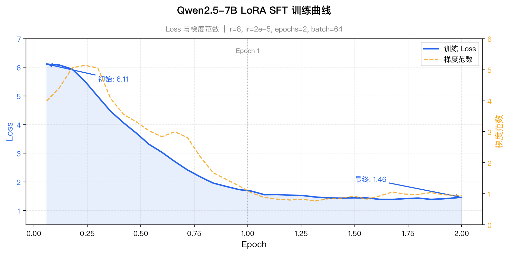

# 模型微调文档

## 概述

基于 Qwen2.5-7B-Instruct，使用 LoRA SFT 在烟草客服数据上进行微调，最终产出可用于 ollama 和 omlx 推理的量化模型。

## 训练环境

| 项目 | 配置 |
|------|------|
| 基础模型 | Qwen/Qwen2.5-7B-Instruct（7.6B 参数） |
| 服务器 | AutoDL H800 80GB |
| 训练框架 | transformers + peft |
| 精度 | bf16 |
| 训练耗时 | 约 5 分钟（310 秒） |

## 数据集

数据来源为 JD 客服对话数据 + 烟草领域补充数据，格式为 alpaca（instruction/input/output）。

- JD 客服数据：[JDDC-Baseline-Seq2Seq](https://github.com/SimonJYang/JDDC-Baseline-Seq2Seq)
- 烟草领域数据：项目自行构造

| 项目 | 数值 |
|------|------|
| 总样本数 | 10,629 |
| JD 客服数据 | 10,593 条 |
| 烟草领域数据 | 36 条 |
| 最大序列长度 | 512 tokens |

数据预处理使用 Qwen2.5 的 chat template 将 instruction/input/output 组装为 system + user + assistant 的对话格式，再进行 tokenize。

## 训练脚本

```python
import json, torch
from transformers import (
    AutoModelForCausalLM, AutoTokenizer,
    TrainingArguments, Trainer, DataCollatorForSeq2Seq,
)
from peft import LoraConfig, get_peft_model
from datasets import Dataset

# 加载数据
with open('/root/LLaMA-Factory/data/tobacco_alpaca.json') as f:
    raw_data = json.load(f)

# 加载模型和分词器
model_path = '/root/autodl-tmp/Qwen2.5-7B-Instruct'
tokenizer = AutoTokenizer.from_pretrained(model_path, trust_remote_code=True)
model = AutoModelForCausalLM.from_pretrained(
    model_path, torch_dtype=torch.bfloat16, device_map='auto', trust_remote_code=True,
)

# LoRA 配置
lora_config = LoraConfig(
    r=8, lora_alpha=16,
    target_modules=['q_proj', 'v_proj'],
    lora_dropout=0.05, bias='none', task_type='CAUSAL_LM',
)
model = get_peft_model(model, lora_config)

# 数据处理：使用 chat template 组装对话格式
def tokenize_fn(examples):
    texts = []
    for inst, inp, out in zip(examples['instruction'], examples['input'], examples['output']):
        msgs = [
            {'role': 'system', 'content': inst},
            {'role': 'user', 'content': inp},
            {'role': 'assistant', 'content': out},
        ]
        texts.append(tokenizer.apply_chat_template(msgs, tokenize=False))
    tokenized = tokenizer(texts, truncation=True, max_length=512)
    tokenized['labels'] = [ids.copy() for ids in tokenized['input_ids']]
    return tokenized

dataset = Dataset.from_list(raw_data)
tokenized_dataset = dataset.map(tokenize_fn, batched=True, remove_columns=dataset.column_names)

# 训练参数
args = TrainingArguments(
    output_dir='/root/autodl-tmp/output/qwen25_full',
    num_train_epochs=2,
    per_device_train_batch_size=32,
    gradient_accumulation_steps=2,
    learning_rate=2e-5,
    warmup_ratio=0.1,
    lr_scheduler_type='cosine',
    logging_steps=10,
    save_steps=100,
    bf16=True,
    gradient_checkpointing=False,
    report_to='none',
    save_total_limit=2,
)

# 开始训练
collator = DataCollatorForSeq2Seq(tokenizer=tokenizer, padding=True)
trainer = Trainer(
    model=model, args=args,
    train_dataset=tokenized_dataset, data_collator=collator,
)
trainer.train()

# 保存 LoRA adapter
model.save_pretrained('/root/autodl-tmp/output/qwen25_full/final')
tokenizer.save_pretrained('/root/autodl-tmp/output/qwen25_full/final')
```

## LoRA 配置

| 参数 | 值 | 说明 |
|------|-----|------|
| r (rank) | 8 | 低秩矩阵的秩，控制参数量 |
| lora_alpha | 16 | 缩放因子，alpha/r = 2 |
| target_modules | q_proj, v_proj | 注意力层的 query 和 value 投影 |
| lora_dropout | 0.05 | Dropout 比例 |
| 可训练参数 | 2,523,136 | 占总参数 0.033% |

## 训练超参数

| 参数 | 值 | 说明 |
|------|-----|------|
| num_train_epochs | 2 | 训练轮数 |
| per_device_train_batch_size | 32 | 单卡 batch size |
| gradient_accumulation_steps | 2 | 梯度累积步数 |
| effective_batch_size | 64 | 有效 batch size = 32 × 2 |
| learning_rate | 2e-5 | 学习率 |
| warmup_ratio | 0.1 | 预热比例，前 10% 步数线性升温 |
| lr_scheduler_type | cosine | 余弦退火调度 |
| max_length | 512 | 最大序列长度 |
| bf16 | True | 混合精度训练 |
| gradient_checkpointing | False | 关闭（与 peft bf16 有兼容问题） |

### Loss 曲线图



### 逐点 Loss 数据

| Epoch | Loss | Grad Norm |
|-------|------|-----------|
| 0.06 | 6.11 | 3.99 |
| 0.12 | 6.08 | 4.42 |
| 0.18 | 5.93 | 5.06 |
| 0.24 | 5.51 | 5.14 |
| 0.30 | 4.98 | 5.05 |
| 0.36 | 4.46 | 4.07 |
| 0.42 | 4.06 | 3.56 |
| 0.48 | 3.70 | 3.32 |
| 0.54 | 3.31 | 3.03 |
| 0.60 | 3.03 | 2.84 |
| 0.66 | 2.71 | 3.00 |
| 0.72 | 2.42 | 2.81 |
| 0.78 | 2.17 | 2.19 |
| 0.84 | 1.96 | 1.68 |
| 0.90 | 1.84 | 1.47 |
| 0.96 | 1.73 | 1.26 |
| 1.02 | 1.68 | 1.03 |
| 1.08 | 1.55 | 0.88 |
| 1.14 | 1.56 | 0.83 |
| 1.20 | 1.54 | 0.80 |
| 1.26 | 1.52 | 0.82 |
| 1.32 | 1.47 | 0.77 |
| 1.38 | 1.44 | 0.84 |
| 1.44 | 1.43 | 0.86 |
| 1.50 | 1.44 | 0.92 |
| 1.56 | 1.44 | 0.83 |
| 1.62 | 1.39 | 0.93 |
| 1.68 | 1.39 | 1.06 |
| 1.74 | 1.41 | 0.99 |
| 1.80 | 1.44 | 0.98 |
| 1.86 | 1.39 | 1.04 |
| 1.92 | 1.41 | 0.97 |
| 1.98 | 1.46 | 0.94 |

### 训练统计

| 指标 | 值 |
|------|-----|
| 初始 loss | 6.11 |
| 最终 loss | 1.46 |
| 平均 loss | 2.56 |
| 训练速度 | 68.55 samples/s |
| 步速度 | 1.08 steps/s |
| 总步数 | 334 |

### 分析

1. **收敛良好**：Loss 从 6.11 稳步下降到 1.46，无 loss collapse
2. **无过拟合**：Epoch 2 的 loss 与 Epoch 1 基本持平（~1.4），未出现上升
3. **梯度稳定**：grad_norm 从 ~5 下降到 ~1 后稳定，无异常 spike
4. **训练高效**：5 分钟完成 2 epoch，充分利用 H800 算力

## 模型产出

训练完成后经过合并和量化，产出两种格式：

| 格式 | 文件 | 大小 | 用途 | 下载链接 |
|------|------|------|------|----------|
| GGUF Q4_K_M | ollama `tobacco-csa` | 4.7GB | ollama API 推理 | [ModelScope](https://modelscope.cn/models/Pleaside/Qwen2.5-7B-tobacco-gguf) |
| MLX 4-bit | `Qwen2.5-7B-tobacco-mlx` | 4.0GB | Apple Silicon 原生推理 | [ModelScope](https://modelscope.cn/models/Pleaside/Qwen2.5-7B-tobacco-mlx) |

### 量化流程

```
LoRA adapter → 合并到基座模型 → 量化
                 ↓                  ↓
          HuggingFace 格式     GGUF (llama.cpp)
           (15GB safetensors)   MLX (mlx_lm.convert)
```

1. **LoRA 合并**：在 H800 服务器上将 LoRA adapter 合并回基座模型，产出 15GB 的 HuggingFace 格式模型
2. **GGUF 量化**：使用 llama.cpp 的 `convert_hf_to_gguf.py` + `quantize` 工具，Q4_K_M 量化，产出 4.4GB GGUF 文件
3. **MLX 量化**：在本地 Mac 上使用 `mlx_lm.convert --q-bits 4`，产出 4.0GB MLX 格式模型

### 推理性能对比

在 Apple Silicon Mac 上测试（同一组 3 个烟草领域问题）：

| 指标 | ollama (GGUF Q4_K_M) | omlx (MLX 4-bit) |
|------|----------------------|-------------------|
| 平均速度 | ~27 tokens/s | ~25 tokens/s |
| 回复质量 | 准确简洁 | 准确，偶有重复 |
| 输出可控性 | 好 | 一般 |

**推荐使用 ollama 版本**，速度更快且输出更稳定。
